# Incident Report — Streamer (Malvertising → Trojanized Installer)

**Analyst:** Carvajal-Hc
**Date:** 2025-09-03
**Classification:** Lab exercise — HTB Sherlock "Streamer" (Hard)
**Evidence:** KAPE triage collection from a Windows 10 workstation (`forela-wkstn001.forela.local`), user account `simon.stark`

**Confidentiality.** This report documents a controlled lab investigation (HTB Sherlock). All hosts, accounts, addresses, and hashes belong to a training scenario and do not correspond to any production system.

---

## 1. Executive Summary

**Incident ID:** `INC-2023-0505-001`
**Severity:** Critical (P1)
**Status:** Resolved (evidence analysis complete)
**Incident type:** Malvertising · Trojanized installer · Backdoor with persistence · Data exfiltration

### Incident summary

On 5 May 2023, a developer at Forela searched for OBS Studio — legitimate open-source streaming software — in order to record coding sessions with colleagues. He downloaded the installer from a promoted search result and ran it.

The site was not the official project. `obsproicet.net` is a typosquat of the real `obsproject.com`, served over plain HTTP, distributing an archive named exactly like the genuine installer. The archive contained a trojanized setup file that installed a working copy of OBS Studio **and** a backdoor. From the user's perspective nothing went wrong: the software he wanted appeared and worked.

The compromise took four minutes. At 10:19:46 UTC the archive finished downloading; by 10:23:28 the backdoor had executed, registered persistence disguised as a Windows COM component, probed for an analysis environment, and contacted an Amazon S3 bucket.

No user error is identifiable. The developer searched for real software, clicked a top result, and executed an installer that carried the correct filename and delivered the correct product.

### Key findings

- **Initial access:** malicious advertising / SEO poisoning (T1583.008). The user reached an attacker-controlled clone of a well-known software project through a promoted search result.
- **Vulnerability exploited:** none. No exploit, no privilege escalation, no bypassed control — none was in the path.
- **Delivery:** `OBS-Studio-28.1.2-Full-Installer-x64.zip`, downloaded over HTTP from `obsproicet.net` (`13.232.96.186`), containing a trojanized setup binary that also installed genuine OBS Studio as cover.
- **Backdoor:** an executable with a randomly generated multi-word name, dropped in a directory of the same style under the user profile, executed at 10:23:19.
- **Persistence:** scheduled task **`COMSurrogate`** — matching the display name of the legitimate `dllhost.exe` process — running the backdoor at every logon with `HighestAvailable` privileges.
- **Exfiltration:** the backdoor resolved `bbuseruploads.s3.amazonaws.com` at 10:23:28, with OCSP certificate validation confirming a TLS session was negotiated.
- **Data compromised:** the destination is attacker-controlled storage. Volume and content of what was transferred cannot be determined from the collected artifacts.

### Immediate actions taken

- Endpoint triaged with KAPE on 2023-05-08; collection preserved for analysis.
- Full artifact analysis completed across filesystem, program execution, registry, event log, and network sources.
- Indicators extracted for an environment-wide sweep.

### Impact to stakeholders

| Stakeholder | Potential impact |
|---|---|
| **Customers** | Unknown. Exfiltration to attacker-controlled storage is confirmed; contents are not. If the developer held customer data or source code locally, exposure must be assumed. |
| **Employees** | Credentials and browser session data on the host should be treated as compromised. The backdoor ran with elevated privileges under the user's context. |
| **Business partners** | Unknown, contingent on what left the host. |
| **Regulatory bodies** | Confirmed exfiltration to an external endpoint may constitute a reportable breach depending on data classification. Legal review required. |
| **Internal teams** | Developer workstation compromised while domain-joined. No lateral movement observed in the collected artifacts. |
| **Shareholders** | Material if source code or intellectual property was among the exfiltrated data. |

### Activity at a glance

| Phase | Action | Outcome | Key artifact |
|---|---|---|---|
| Delivery | Archive downloaded over HTTP from `obsproicet.net` | Completed | `$J`, Zone.Identifier ADS |
| User action | Archive renamed and moved to `Documents\Streaming Software` | Completed | `$J`, `$MFT` |
| Execution | Trojanized installer run; genuine OBS Studio installed as cover | Completed | Prefetch, Amcache |
| Implant | Backdoor dropped and executed from the user profile | Completed | Prefetch, `$J` |
| Defense evasion | Query to a non-existent TLD — analysis-environment check | Completed | DNS-Client 3006 |
| Persistence | Scheduled task `COMSurrogate` registered at logon, elevated | Completed | Security 4698 |
| Exfiltration | S3 bucket resolved, TLS session established | Completed | DNS-Client 3006/3008 |

---

## 2. Technical Analysis

### 2.1 Affected systems and data

| Host | Role | Level of compromise |
|---|---|---|
| `forela-wkstn001.forela.local` (`172.17.79.129`) | Developer workstation, Windows 10 | **Compromised** — backdoor executed, persistence installed, exfiltration confirmed |
| `13.232.96.186` (`obsproicet.net`) | Attacker distribution server | External infrastructure |
| `bbuseruploads.s3.amazonaws.com` | Exfiltration destination | External infrastructure (AWS-hosted) |

Affected account: `FORELA\simon.stark`, SID `S-1-5-21-3239415629-1862073780-2394361899-1602`.

### 2.2 Sources of evidence and analysis

| Evidence | Parser | Finding |
|---|---|---|
| `$MFT` | MFTECmd | File paths, resident data recovery |
| `$Extend\$J` (USN Journal) | MFTECmd | Download, rename and creation sequence with timestamps |
| `Windows\prefetch\*.pf` | PECmd | Execution evidence, backdoor path, prefetch hash |
| `Amcache.hve` | AmcacheParser | SHA-1 of the trojanized setup |
| `winevt\Logs\*.evtx` | EvtxECmd | DNS resolution, scheduled task registration |
| `LogFiles\Firewall\pfirewall.log` | (plain text) | Source ports and connection timing |
| `NTUSER.DAT`, `UsrClass.dat` | SBECmd | Folder navigation |
| `Recent\*.lnk` | LECmd | File access, target paths and sizes |

Analysis performed in **Timeline Explorer** across the resulting CSVs.

#### Delivery — the download

The USN Journal records every filesystem change with a reason code, which makes it the authoritative source for a file's history regardless of renaming. Filtering on the archive's MFT record returns its full lifecycle:

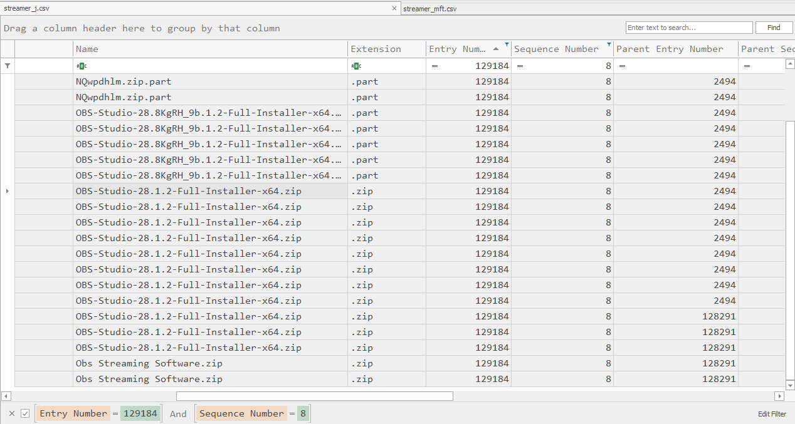

```
10:19:46   NQwpdhlm.zip.part                                  FileCreate
10:19:46   OBS-Studio-28.8KgRH_9b.1.2-Full-Installer-x64.part RenameNewName
10:20:47   OBS-Studio-28.8KgRH_9b.1.2-...-x64.part            DataExtend
10:20:48   OBS-Studio-28.1.2-Full-Installer-x64.zip           RenameNewName
10:22:23   Obs Streaming Software.zip                         RenameNewName
```

The first two entries are browser download temporaries — the `.part` extension marks an incomplete transfer. The archive as saved was named **`OBS-Studio-28.1.2-Full-Installer-x64.zip`**, byte-identical to what the official project serves.

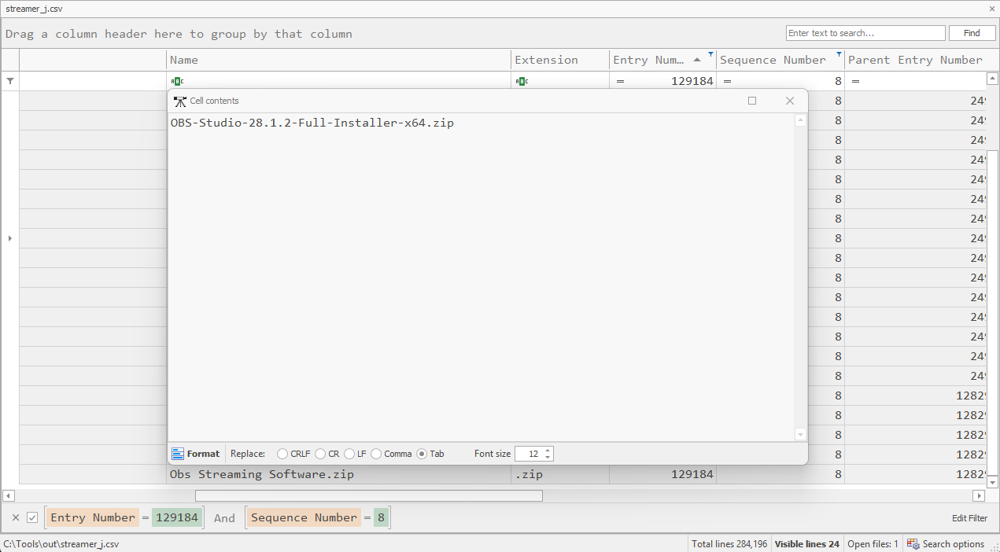

**Entry Number alone does not identify a file.** MFT record 129184 had been reused by at least six previous files: NTFS recycles record numbers and increments a **Sequence Number** on each reuse. Filtering on the entry number alone returned 50 rows spanning unrelated files. The unique identifier is the pair, the same way `ProcessGuid` rather than PID identifies a process.

#### The rename

At 10:22:23 the user renamed the archive and placed it in a folder he had created a few minutes earlier. The `$J` has no path column, so the parent entry number was resolved against the `$MFT`:

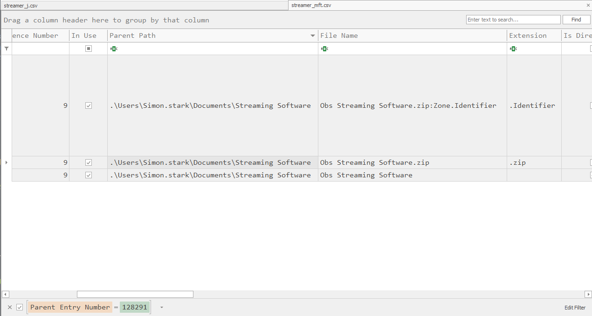
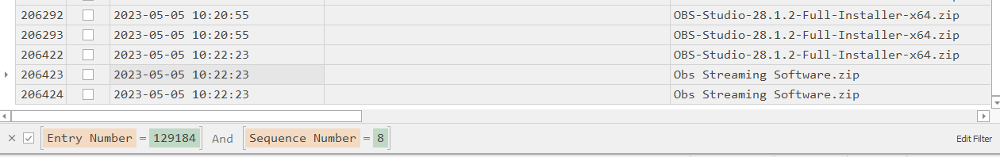

```
C:\Users\Simon.stark\Documents\Streaming Software\Obs Streaming Software.zip
```

Renaming a downloaded installer to something descriptive is ordinary user behaviour and has no security significance on its own — but it means the filename on disk no longer matches what was downloaded, which is why the `$J` rather than the `$MFT` answers the question of what the file was originally called.

#### The download URL

The `$MFT` listing showed an alternate data stream attached to the archive:

```
Obs Streaming Software.zip:Zone.Identifier
```

Windows attaches this Mark-of-the-Web stream to everything downloaded from the internet. At around 166 bytes it is MFT-resident: its content lives inside the MFT record rather than in allocated clusters, and therefore survives in the `$MFT` even though the file itself was not part of the triage collection. MFTECmd extracts resident data with `--dr`, writing each resident file to disk.

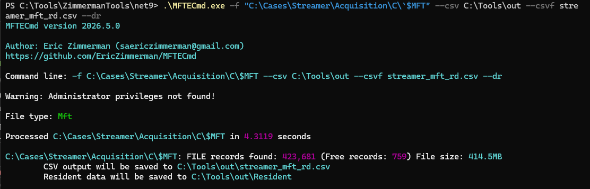
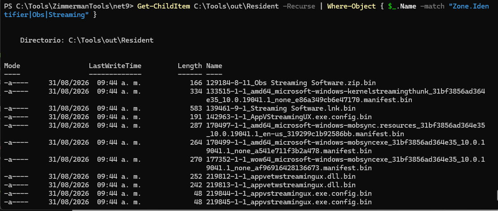

```
[ZoneTransfer]
ZoneId=3
ReferrerUrl=http://obsproicet.net/download/v28_23/
HostUrl=http://obsproicet.net/download/v28_23/OBS-Studio-28.1.2-Full-Installer-x64.zip
```

Three findings from a single artifact:

**`obsproicet.net` is a typosquat** of `obsproject.com` — `project` transposed to `proicet`, and `.net` instead of `.com`. In a promoted search result neither is noticeable.

**Plain HTTP.** The official project enforces HTTPS. This alone is a meaningful signal at the network layer.

**`ReferrerUrl` on the same domain** shows the user navigated within the clone site before downloading, consistent with arriving through an advertisement rather than a direct link.

This also recovered the download URL after the browser history proved useless: Edge's `History` for this profile contained nothing from the incident day.

#### Hosting infrastructure

`Microsoft-Windows-DNS-Client/Operational` logs every name resolution performed on the host, including the returned address. Event ID 3008 carries the response:

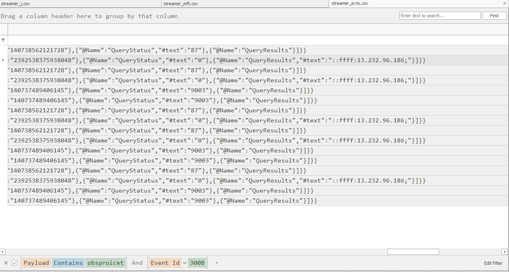

```
obsproicet.net → 13.232.96.186
```

This log is not enabled by default in many environments and is frequently overlooked, but it provides a per-host DNS record without requiring network capture.

#### Network connections

Windows Firewall maintains a plain-text log at `C:\Windows\System32\LogFiles\Firewall\pfirewall.log`. It is not an event log and needs no parser. Filtering on the resolved IP:

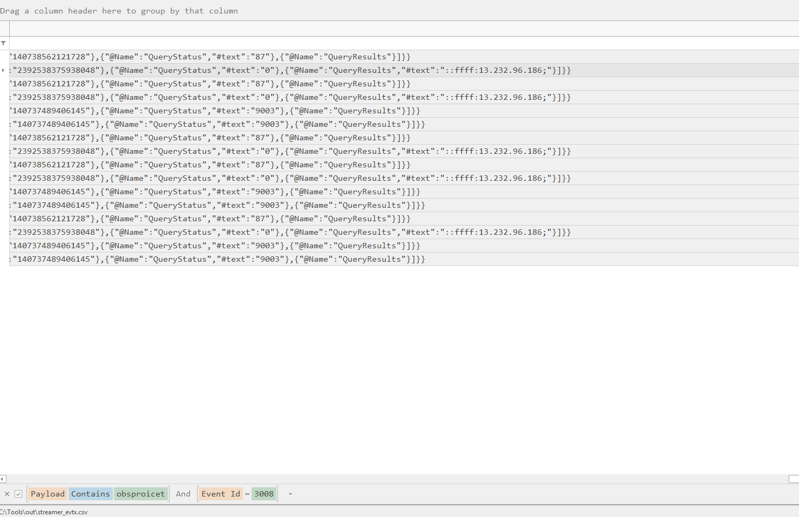

```
15:19:39  ALLOW TCP  172.17.79.129 → 13.232.96.186  49996 → 80
15:19:39  ALLOW TCP  172.17.79.129 → 13.232.96.186  49997 → 80
15:19:42  ALLOW TCP  172.17.79.129 → 13.232.96.186  50006 → 80
15:19:42  ALLOW TCP  172.17.79.129 → 13.232.96.186  50007 → 80
15:19:45  ALLOW TCP  172.17.79.129 → 13.232.96.186  50008 → 80
15:24:17  ALLOW TCP  172.17.79.129 → 13.232.96.186  50045 → 80
```

Highest source port: **50045**.

Five parallel connections within six seconds are the download itself — browsers open multiple TCP streams for a 134 MB file, each taking a sequential ephemeral port. The sixth, nearly five minutes later, postdates the installer's execution and is a separate contact with the server.

**Timezone note.** `pfirewall.log` records local time; the `$MFT` and event logs record UTC. The five-hour offset is normalized throughout this report — all times are UTC unless marked otherwise.

#### The trojanized installer

Amcache is a registry hive Windows maintains for application compatibility. It records executables the system has seen, including a **SHA-1 hash** — one of the few forensic artifacts that yields a file hash without the file itself.

The `UnassociatedFileEntries` output holds executables not tied to a registered installed program, which is where a standalone installer extracted from an archive lands.

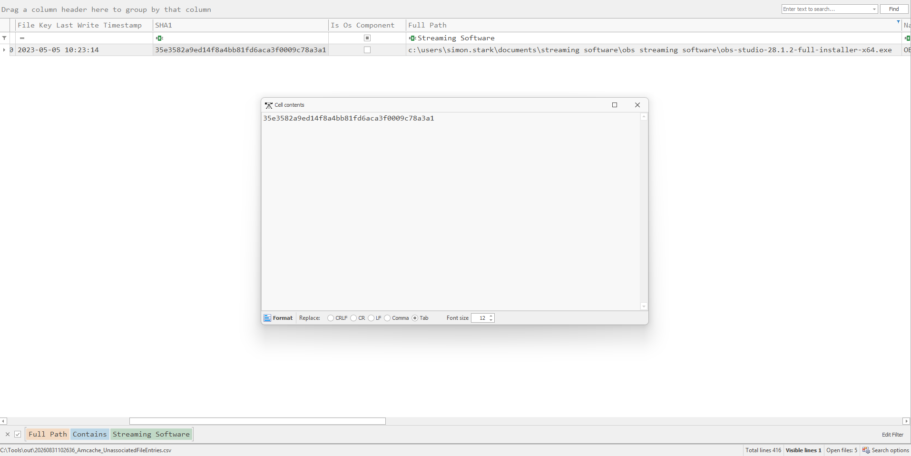

```
SHA1: 35e3582a9ed14f8a4bb81fd6aca3f0009c78a3a1
```

Amcache stores SHA-1 values prefixed with four zeroes; these are stripped above.

#### The backdoor

Prefetch records the last eight executions of every binary with a run count and the files each process touched. Filtering to 2023-05-05 returned 54 executables, of which the overwhelming majority were Windows components or the genuine OBS Studio installation in progress — `OBS64.EXE`, `ENC-AMF-TEST64.EXE`, `GET-GRAPHICS-OFFSETS32/64.EXE`, `CHECK_FOR_64BIT_VISUAL_STUDIO.EXE`.

That is the trojan working as designed. The user received the software he asked for, which is why nothing appeared wrong.

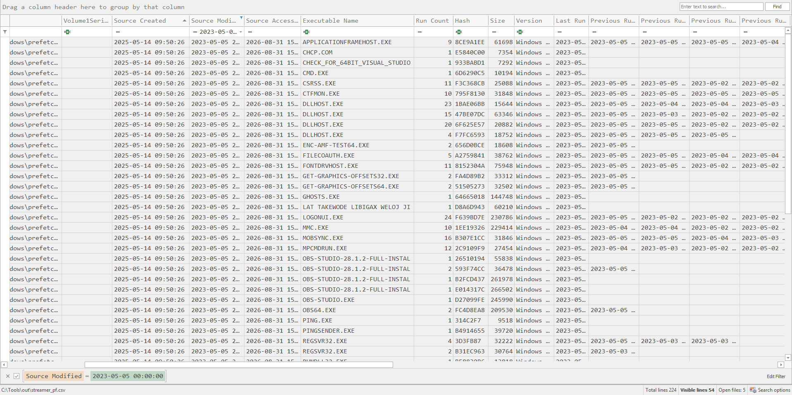

The anomaly against that baseline was an executable with a name of random words. Prefetch truncates executable names at 29 characters, so the full path had to be recovered by parsing the `.pf` and reading its referenced files:

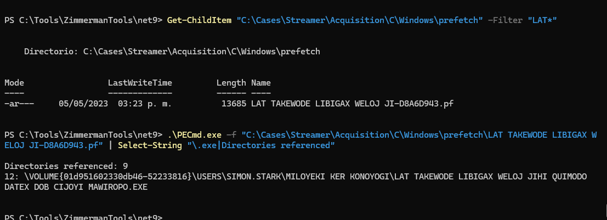

```
C:\Users\Simon.stark\Miloyeki ker konoyogi\lat takewode libigax weloj jihi quimodo datex dob cijoyi mawiropo.exe
```

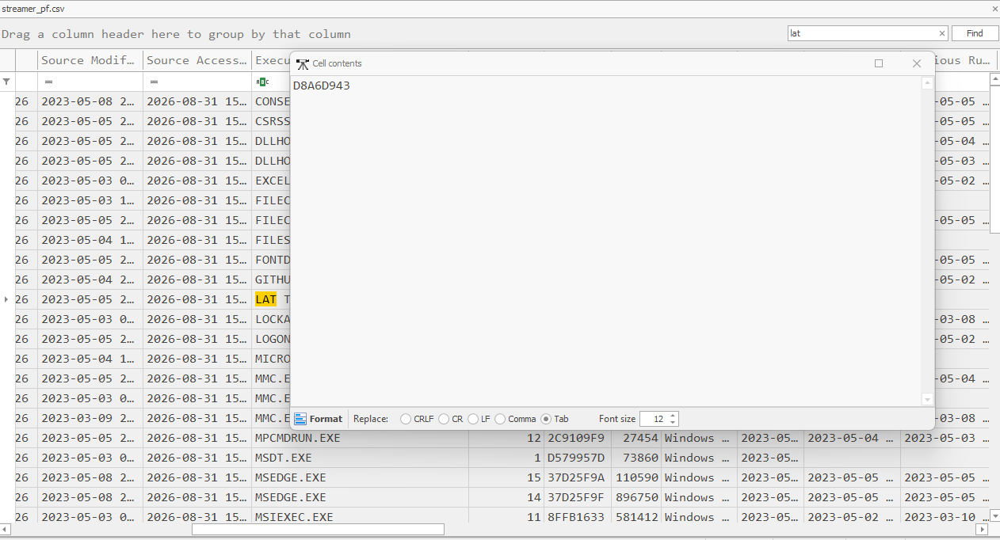

Prefetch hash: **`D8A6D943`** — a hash of the full path, not the file contents. Windows uses it so identical filenames in different directories produce distinct `.pf` files.

**On the naming.** Both the directory and the filename are strings of random pronounceable words separated by spaces. Spaces in paths break naive parsers and the length exceeds what several forensic artifacts display in full: the scheduled task XML below splits this single path across two fields at the first space.

#### Persistence

Security event **4698** records scheduled task creation. Twenty-two tasks existed on the host; twenty-one dated to system installation and configuration, and one to the incident window.

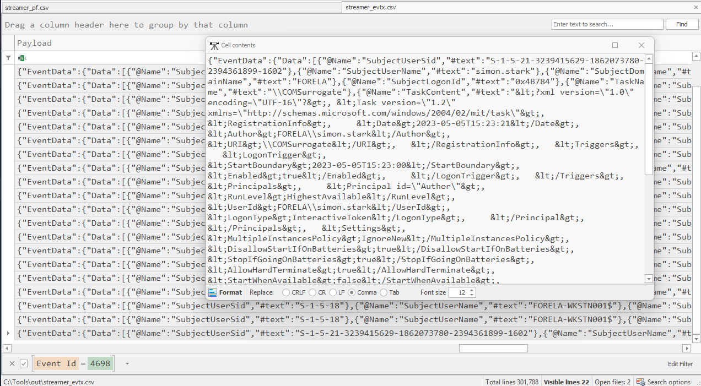

```
TaskName:   \COMSurrogate
Registered: 2023-05-05 10:23:21 UTC
Author:     FORELA\simon.stark
Trigger:    LogonTrigger
RunLevel:   HighestAvailable
Command:    C:\Users\Simon.stark\Miloyeki ker konoyogi\lat takewode ... mawiropo.exe
```

**`COMSurrogate` is the display name of `dllhost.exe`**, a legitimate Windows process that hosts COM objects out-of-process. Four `DLLHOST.EXE` instances appear in this host's own Prefetch data. A scheduled task by that name reads as system infrastructure to anyone scanning Task Scheduler.

The task runs at every logon with the highest available privileges — persistence that survives reboot and needs no further attacker interaction.

#### Command and control

Filtering DNS-Client queries to the minute following the backdoor's execution returned 91 events. Two are not attributable to normal browsing.

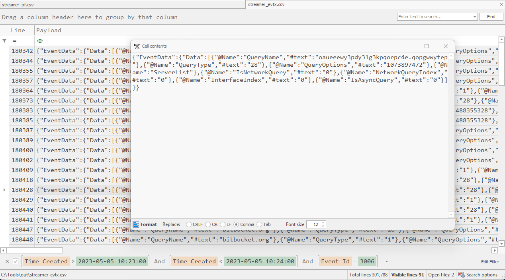

```
10:23:19   oaueeewy3pdy31g3kpqorpc4e.qopgwwytep
```

**This domain cannot resolve: `.qopgwwytep` is not a valid TLD.** The root zone contains a finite, published list of top-level domains and this is not among them. Querying a name that cannot exist is an analysis-environment check — if an invented name resolves, DNS is being intercepted and the host is a sandbox. Malware uses the result to decide whether to run its real payload.

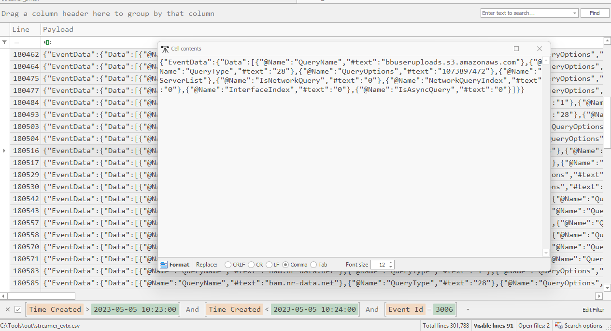

```
10:23:28   bbuseruploads.s3.amazonaws.com
```

The queries immediately following are OCSP certificate-validation lookups against `digicert.com` and `amazontrust.com`, confirming a TLS session was negotiated rather than a name merely resolved.

**Why S3 works as an exfiltration channel.** The destination domain is `amazonaws.com`, which no organization can block — a large share of the internet runs on AWS. The traffic is HTTPS with a valid certificate chain. The bucket owner is identifiable only through legal process to Amazon. Nothing about the connection looks anomalous at the network layer.

#### Recovered user note

`Week 1 plan.txt` in `Documents\Coding Jam sessions` is 57 bytes. NTFS stores file contents under roughly 700 bytes inside the MFT record rather than allocating clusters, so the content survived even though the file was not part of the triage collection.

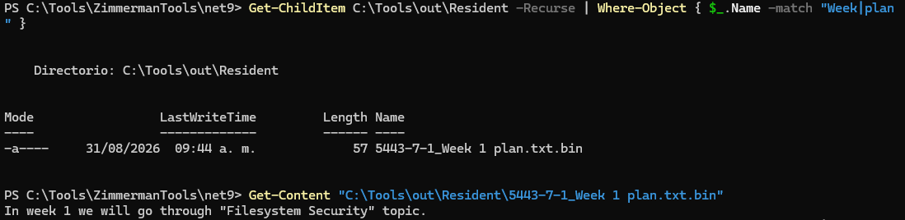

```
In week 1 we will go through "Filesystem Security" topic.
```

The content is incidental to the compromise but confirms the scenario: the user was preparing legitimate technical content, which is why he was looking for streaming software at all.

#### Response actions on the host

Shellbags record every folder opened in Windows Explorer — including UNC paths and folders that no longer exist. Windows maintains them for per-folder view preferences; the navigation history is a side effect.

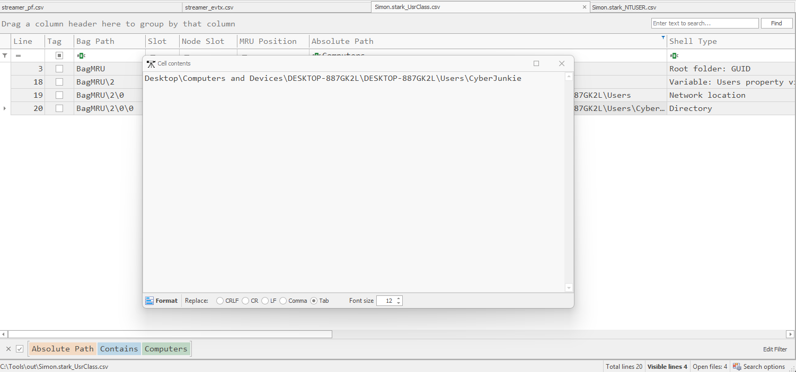
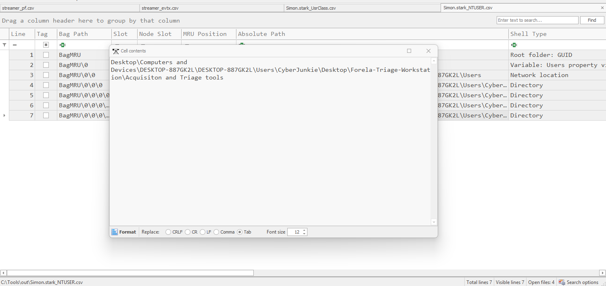

Triage was performed by **CyberJunkie**, running acquisition tooling from:

```
\\DESKTOP-887GK2L\Users\CyberJunkie\Desktop\Forela-Triage-Workstation\Acquisiton and Triage tools
```

(`Acquisiton` is misspelled in the source path and reproduced verbatim.)

Prefetch confirms `GKAPE.EXE` executed once, on 2023-05-08 11:45:04 — three days after the compromise, and the upper bound of all evidence in this collection.

### 2.3 Indicators of Compromise

| Type | Value |
|---|---|
| **Domain** | `obsproicet.net` (typosquat of `obsproject.com`) |
| **URL** | `http://obsproicet.net/download/v28_23/OBS-Studio-28.1.2-Full-Installer-x64.zip` |
| **IP** | `13.232.96.186` |
| **Bogus domain** | `oaueeewy3pdy31g3kpqorpc4e.qopgwwytep` |
| **Exfiltration endpoint** | `bbuseruploads.s3.amazonaws.com` |
| **Archive** | `OBS-Studio-28.1.2-Full-Installer-x64.zip` (134,053,544 bytes) |
| **Setup SHA-1** | `35e3582a9ed14f8a4bb81fd6aca3f0009c78a3a1` |
| **Backdoor path** | `C:\Users\Simon.stark\Miloyeki ker konoyogi\lat takewode libigax weloj jihi quimodo datex dob cijoyi mawiropo.exe` |
| **Backdoor Prefetch hash** | `D8A6D943` |
| **Persistence** | Scheduled task `\COMSurrogate`, LogonTrigger, HighestAvailable |

### 2.4 Root Cause Analysis

**Primary root cause:** software was acquired from a search engine result rather than a verified vendor source, with no organizational control preventing the download and execution of an unsigned installer.

Contributing factors:

- **No allowlisting or installer verification.** Any user could download and run an arbitrary executable. No hash or signature check stood between the search result and execution.
- **Plain HTTP download permitted.** A control blocking or flagging executable downloads over HTTP would have caught this at the network boundary.
- **DNS-Client operational logging present but unmonitored.** The logs that ultimately resolved the case were collecting locally and reaching no detection pipeline. The sandbox check and the exfiltration lookup were both recorded in real time; neither generated an alert.
- **Scheduled task creation not monitored.** Event 4698 fired when the persistence was installed. Nothing consumed it.
- **No egress restriction on cloud storage.** Exfiltration to S3 succeeded without impediment.

**What was not a factor.** No vulnerability was exploited, no credential was stolen to gain access, and no security control was bypassed — because none was in the path. The user's behaviour was reasonable throughout.

### 2.5 Timeline (by phase)

**Delivery** — 10:19:46 to 10:20:48

The archive downloads from `obsproicet.net` over HTTP across five parallel TCP connections. Windows attaches a Zone.Identifier stream recording the source URL.

**User action** — 10:19:56 to 10:22:34

The user creates `Documents\Streaming Software`, renames the archive to `Obs Streaming Software.zip` at 10:22:23, and extracts it at 10:22:34.

**Execution** — 10:23:14

The trojanized installer runs. Genuine OBS Studio installs alongside the payload, leaving the expected trail of OBS component executions in Prefetch.

**Implant and evasion** — 10:23:19

The backdoor is created and executed from the user profile. Within the same second it queries a domain with a non-existent TLD, checking whether it is running in an analysis environment.

**Persistence** — 10:23:21

`schtasks.exe` runs; the task `COMSurrogate` is registered to launch the backdoor at every logon with elevated privileges.

**Exfiltration** — 10:23:28

The backdoor resolves an S3 bucket and negotiates a TLS session, confirmed by the OCSP validation traffic that follows.

**Acquisition** — 2023-05-08 11:45:04

The endpoint is triaged with gKAPE, three days later.

---

## 3. Response and Recovery

### Detection

The compromise was not detected by any control. The artifacts show at least three events that should have generated alerts — the HTTP executable download, the scheduled task registration, and the S3 resolution from a non-browser process — passing without response. Discovery was reactive.

### Containment

The host must be isolated. The account `simon.stark` and all credentials accessible from the profile should be treated as compromised, including domain credentials, given that the backdoor ran with elevated privileges under that context.

### Eradication

Reimaging is the only defensible remediation. The backdoor's full capabilities are unknown, exfiltration is confirmed, and the persistence mechanism was built to survive casual inspection. Removing the task and the binary would not establish that nothing else was installed.

### Recovery

The host should be rebuilt from a known-good image with credentials rotated before rejoining the domain.

---

## 4. Recommendations

| # | Recommendation | Priority | Timeline |
|---|---|---|---|
| 1 | Reimage the workstation and rotate all credentials accessible from the profile, including domain credentials. | Critical | Immediate |
| 2 | Sweep the environment for the IoCs in section 2.3, prioritising the scheduled task name `COMSurrogate` and DNS queries to the bogus domain and the S3 bucket. | Critical | Immediate |
| 3 | Determine what data resided on the host and assess it against the confirmed exfiltration. Involve legal for notification assessment. | Critical | 48 hours |
| 4 | Forward DNS-Client operational logs to the SIEM and alert on queries to non-existent TLDs and to cloud storage endpoints from non-browser processes. Both events in this incident were logged locally and never seen. | High | 30 days |
| 5 | Alert on Security event 4698 for scheduled tasks whose action path falls outside `System32` or `Program Files`. | High | 30 days |
| 6 | Block or alert on executable downloads over plain HTTP at the web proxy. | High | 30 days |
| 7 | Publish a verified software source list for commonly requested tools and route installation requests through it rather than through search. This addresses the actual root cause. | High | 60 days |
| 8 | Deploy application allowlisting on developer workstations, or at minimum block execution from user-profile directories. | Medium | 90 days |
| 9 | Restrict or monitor egress to cloud storage providers from endpoints with no business need for it. | Medium | 90 days |
| 10 | Brief staff on malvertising specifically. Standard phishing awareness does not cover it: there was no email, no link to hover over, and the delivered software worked as expected. | Medium | 60 days |

---

## 5. Detection Engineering

| Technique | MITRE | Detection |
|---|---|---|
| Malvertising / SEO poisoning | T1583.008 | Proxy logs: executable download over HTTP; newly registered domains; domains with low edit distance to known software vendors. |
| Trojanized installer execution | T1204.002 | Sysmon EID 1 with `Image` under `\Users\*\Downloads\` or `\Documents\`, preceded by EID 11 from a browser process. |
| Backdoor in user profile | T1547 | Sysmon EID 1 where `Image` path is outside `Program Files` and `System32` and is unsigned. |
| Scheduled task persistence | T1053.005 | **Security EID 4698**, alerting on action paths outside system directories. Also `schtasks.exe` execution followed within seconds by 4698. |
| Masquerading as system component | T1036.004 | 4698 where the task name matches a known Windows service or COM display name (`COMSurrogate`, `WindowsUpdate`, `OneDrive Sync`) but the action path does not. |
| Analysis-environment check | T1497.001 | **DNS-Client EID 3006** for a query whose TLD is not in the IANA root zone. Extremely low false-positive rate. |
| Exfiltration to cloud storage | T1567.002 | DNS-Client EID 3006 or Sysmon EID 22 for `*.s3.amazonaws.com` from a process that is not a browser or approved sync client, correlated with Sysmon EID 3 outbound volume. |

Two of these deserve emphasis because they cost nothing and would have caught this incident twice:

**Invalid-TLD DNS queries.** Comparing the TLD of every resolved name against the published root zone is a cheap check with almost no legitimate matches. The malware announced itself with `.qopgwwytep` four seconds after execution.

**Scheduled task action paths.** Event 4698 already fires; the rule is a path filter. A task whose action lives under a user profile warrants review regardless of its name — and naming it after a Windows component makes it more suspicious, not less.

---

## 6. Appendices

### Annex A — Chronological timeline

| Time (UTC) | Activity | Source |
|---|---|---|
| 2023-05-05 10:19:46 | Archive download completes; Zone.Identifier written | `$J` |
| 2023-05-05 10:19:56 | `Documents\Streaming Software` created | `$MFT`, LNK |
| 2023-05-05 10:20:48 | Archive fully written, `.part` removed | `$J` |
| 2023-05-05 10:22:23 | Archive renamed to `Obs Streaming Software.zip` | `$J` |
| 2023-05-05 10:22:34 | Archive extracted | `$J` |
| 2023-05-05 10:23:14 | Trojanized installer executes | Prefetch |
| 2023-05-05 10:23:19 | Backdoor created and executed | `$J`, Prefetch |
| 2023-05-05 10:23:19 | DNS query to `oaueeewy3pdy31g3kpqorpc4e.qopgwwytep` | DNS-Client 3006 |
| 2023-05-05 10:23:21 | `schtasks.exe` runs; task `COMSurrogate` registered | Prefetch, Security 4698 |
| 2023-05-05 10:23:24 | `cmd.exe`, `ping.exe` execute | Prefetch |
| 2023-05-05 10:23:28 | DNS query to `bbuseruploads.s3.amazonaws.com`; OCSP validation follows | DNS-Client 3006/3008 |
| 2023-05-05 10:24:17 | Final connection to `13.232.96.186:80` (source port 50045) | `pfirewall.log` |
| 2023-05-08 11:45:04 | gKAPE executed; triage collection acquired | Prefetch, shellbags |

### Annex B — Command reference

```powershell
# Filesystem
MFTECmd.exe -f "...\C\$MFT"        --csv out --csvf mft.csv
MFTECmd.exe -f "...\C\$Extend\$J"  --csv out --csvf usn.csv
MFTECmd.exe -f "...\C\$MFT"        --csv out --csvf mft_rd.csv --dr

# Program execution
PECmd.exe -d "...\C\Windows\prefetch" --csv out --csvf pf.csv
PECmd.exe -f "...\prefetch\LAT TAKEWODE LIBIGAX WELOJ JI-D8A6D943.pf"
AmcacheParser.exe -f "...\C\Windows\AppCompat\Programs\Amcache.hve" --csv out -i

# Event logs
EvtxECmd.exe -d "...\C\Windows\System32\winevt\Logs" --csv out --csvf evtx.csv

# Shell / navigation
LECmd.exe  -d "...\Simon.stark\AppData\Roaming\Microsoft\Windows\Recent" --csv out
SBECmd.exe -d "...\C\Users\Simon.stark" --csv out

# Network
Select-String -Path "...\LogFiles\Firewall\pfirewall.log" -Pattern "13.232.96.186"
```

Key filters applied in Timeline Explorer:

```
$J        Entry Number = 129184  AND  Sequence Number = 8
Prefetch  Source Modified = 2023-05-05
EVTX      Event Id = 4698
EVTX      Time Created > 2023-05-05 10:23:00 AND < 10:24:00 AND Event Id = 3006
Shellbags Absolute Path contains "Computers"
```

### Annex C — Analyst notes

**The USN Journal did most of the work, and I nearly skipped it.** My first instinct for the download was the browser history, and Edge's `History` for this user held nothing from the incident day beyond a single PDF. The `$J` had the entire sequence — temporary download names, completion, rename — with timestamps. For anything involving a file that changed name or moved, that is the artifact.

**Entry numbers are not unique.** Filtering the `$J` on the archive's MFT entry number returned 50 rows across six unrelated files. NTFS recycles record numbers and increments a sequence number on reuse; the real identifier is the pair. I read rows belonging to files that had nothing to do with the case before noticing the sequence column was changing.

**The resident-data flag returned more than I expected.** I ran `MFTECmd --dr` intending to get the Zone.Identifier contents into the CSV. Instead it wrote every resident file to disk as an actual file, which meant the ADS and the user's note were both sitting there ready to read. One flag answered two questions.

**I picked the wrong backdoor first.** Two executables broke the Prefetch baseline for the incident day: one with a plausible name and a clean Amcache entry with a full path, and one with a truncated string of nonsense words that was not in Amcache at all. I went with the first and submitted it. It was wrong. The one missing from Amcache was the actual backdoor — I had read its absence as irrelevance, when a binary that executes without ever being registered should have been more interesting, not less.

**Task 11 cost me the most time and the mistake was mine.** I filtered DNS events by Event ID 3008, then tried excluding advertising domains one by one, then filtered by query status, then guessed at TLDs — `.ru`, `.xyz`, `.top`, `.online`. None worked, because the domain uses a TLD that does not exist at all. What I already had and did not use was a precise timestamp: the scheduled task was registered at 10:23:21. Filtering DNS to that single minute returned 91 rows and the domain was visible without any content filter. A timestamp anchored in another artifact beats any guess about content.

**Shellbags were a gap in my knowledge.** For the acquisition path I searched RunMRU, TypedPaths, MountPoints2 and the Prefetch volume information, and none held it. The answer was in shellbags — an artifact I had not used before and had not considered, because I was thinking about *execution* rather than *navigation*. That distinction is the real lesson: Prefetch and Amcache record what ran; shellbags record what was browsed. The analyst opened a network folder in Explorer, which is navigation.

**On tooling.** I parsed each artifact individually with its own Zimmerman tool. KAPE Modules with the `!EZParser` module runs all of them in a single pass and sorts the output into categories. Had I started there, the shellbag CSV would have existed before I needed it.

**On the user.** Nothing in the artifacts suggests Simon Stark did anything careless. He searched for real software, clicked a promoted result, and ran an installer with the correct filename that installed the correct application. Any recommendation framed as user education misses the point; the control that was missing was organizational, not behavioural.
